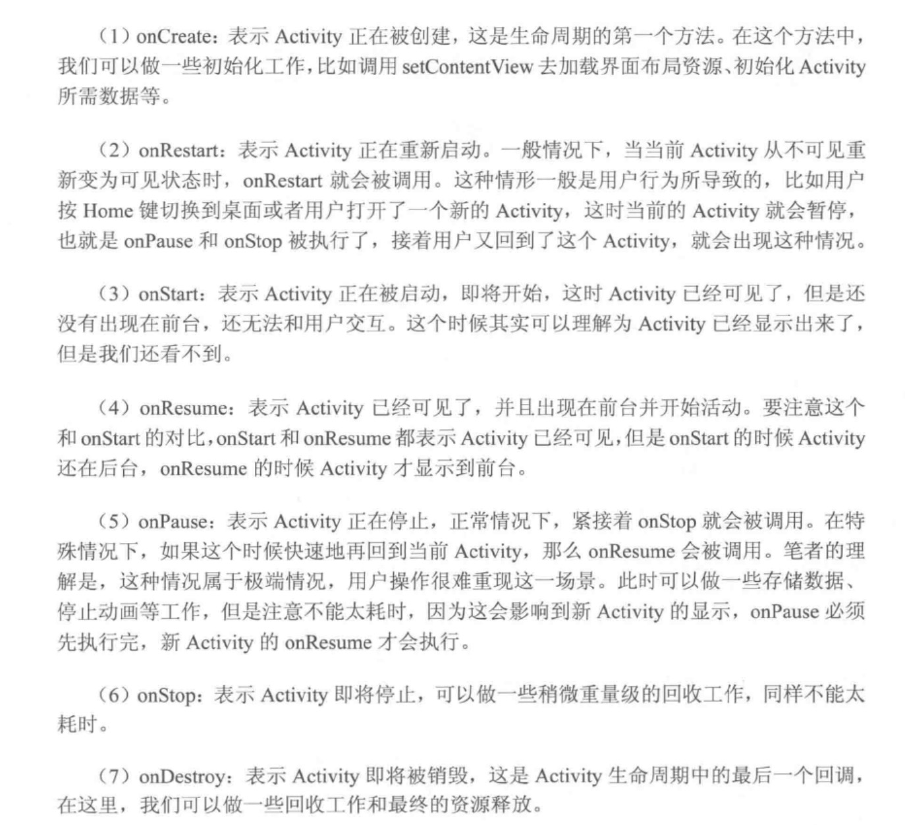

## Activity

#### 1. 说下Activity生命周期

onCreate、onRestart、onStart、onResume、onPuase、 onStop 、onDestory

#### 2. onStart 和 onResume、onPause 和 onStop 的区别

#### 3. Activity A 启动另一个Activity B 会调用哪些方法？如果B是透明主题的又或则是个DialogActivity呢

onPuase--> onCreate -- > onStart -- > onResume -- > onStop

如果B是透明主题，<mark> Activity A 不会调用 onStop 方法</mark>，只要 Activity 可见就不会调用 onStop 方法。

#### 4. Activity A跳转Activity B，再按返回键，生命周期执行的顺序

第一步：Activity A跳转Activity B

​	onPuase--> onCreate -- > onStart -- > onResume -- > onStop 

第二部：按返回键

onPuase--> onCreate -- > onRestart -- > onStart -- > onResume -- > onStop -- onDestory

#### 5. onSaveInstanceState(),onRestoreInstanceState的调用时机

onSaveInstanceState()肯定被执行时机
1、当用户按下HOME键时
2、从最近应用中选择运行其他的程序时
3、按下电源按键（关闭屏幕显示）时
4、从当前activity启动一个新的activity时
5、屏幕方向切换时(竖屏切横屏或横屏切竖屏)

onSaveInstanceState()执行顺序是在onPause()之后，onStop()之前即：
onPause() –> onSaveInstanceState() –> onStop()

注意
如果用户主动销毁Activity，如：按下返回键，或者调用了finish()方法销毁activity，则onSaveInstanceState不会被调用

当系统存在 “未经你允许” 销毁了你的的activity的时，即重建Activity时，onSaveInstanceState()方法会执行，onRestoreInstanceState()方法也会执行，否则onRestoreInstanceState()方法不会执行。

onRestoreInstanceState()是在onStart()之后执行

#### 6. onCreate和onRestoreInstance方法中恢复数据时的区别

因为onSaveInstanceState()方法不一定被调用，所以onCreate()里的Bundle参数可能为空，如果使用onCreate()来恢复数据，一定要做非空判断。

onRestoreInstanceState的Bundle参数一定不会是空值，因为它只有在上次activity被回收了才会被调用。

而且onRestoreInstanceState是在onStart()之后被调用的。有时候我们需要onCreate()中做的一些初始化完成之后再恢复数据，用onRestoreInstanceState会比较方便。

#### 7. Activity的onNewIntent()方法什么时候会执行

当 activity (假设为 A) 的 launchMode 为 singleTop 且 A 的实例已经在 task 栈顶，或者 launchMode 为 singleTask 且 A 的实例已在 task 栈里 (无论是栈顶还是栈中)，再次启动 activity A 时，便不会调用 onCreate() 去产生新的实例，而是调用 onNewIntent() 并重用 task 栈里的 A 实例。

如果 A 在栈顶，那么调用顺序依次是 A.onPause() –> A.onNewIntent() –> A.onResume()。A 的 launchMode 可以是 singleTop 或者是 singlTask.

如果 A 不在栈顶，此时它处于 A.onStop() 状态，当再次启动时，调用顺序依次是 [A.onStop()] –> A.onNewIntent() –> A.onRestart() –> A.onStart() –> A.onResume()。A 的 launchMode 只能是 singleTask。google 到的其它大多文章描述的是这种情况。

#### 8. Activity之间传递数据的方式Intent是否有大小限制，如果传递的数据量偏大，有哪些方案

1. 传512K以下的数据的数据可以正常传递。
2. 传512K~1024K的数据会出错，闪退。
3. 传1024K以上的数据会报错：TransactionTooLargeException。
4. 考虑到Intent还包括要启动的Activity等信息，实际可以传的数据略⼩于512K
数据偏⼤时的⽅案：

解决方案：

1. 将数据保存早全局Application中
2. 使⽤单例数据类
3. 持久化数据

#### 9. ANR 的四种场景

1. Service Timeout:Service在特定的时间内⽆法处理完成
2. BroadcastQueue Timeout：BroadcastReceiver在特定时间内⽆法处理完成
3. ContentProvider Timeout：内容提供者执⾏超时
4. inputDispatching Timeout: 按键或触摸事件在特定时间内⽆响应

#### 10. Activity的启动流程

Activity 启动主要涉及到3个进程:

1. 系统进程 SystemServer （负责管理整个framework，是Zygote孵化的第⼀个进程）
2. App进程（App进程是⽤户点击桌⾯icon时，通过Launcher进程请求SystemServer，再调⽤Zygote孵化的
3. Zygote进程（所有进程孵化都由Zygote完成，⽽Zygote是init进程的⼦进程，也由init进程孵化）

如果点击桌⾯icon启动还会涉及到 Launcher进程（Zygote孵化的第⼀个应⽤进程）
以点击Launcher的⼀个icon为开始，整体扯⼀下Activity的启动过程，桌⾯其实就是LauncherApp的⼀个Activity：

1. 当点击Launcher的icon开始，Launcher进程会像AMS发送点击icon的启动信息（这些信息就是在AndroidMainifest.xml中标签定义的启动信息，数据由PackageManagerService解析出来）；

2. AMS收到信息后会先后经过ActivityTaskManagerService->ActivityStartController->ActivityStarter内部类Request，然后把信息存到Request中，并通知Launcher进程让Activity休眠；

  （补充个⼩知识点，这个过程会检测Activity在AndroidMainifest.xml的注册，如果没有注册就报错了）

3. Launcher进程的ApplicationThread对象收到消息后调⽤handlePauseActivity()进⾏暂停，并通知AMS已经暂停。实现细节：
    ActivityThread.sendMessage()通过ActivityThread的H类发送Handler消息，然后触发
    mTransactionExecutor.execute(transaction)，执⾏过程中依赖ActivityClientRecord.mLifecycleState数值并通过
    ClientTransactionHandler抽象类的实现（ActivityThread）进⾏分发；
    注 ：ActivityClientRecord.mLifecycleState（-1 ~ 7分别代表 UNDEFINED, PRE_ON_CREATE, ON_CREATE, ON_START,
    ON_RESUME, ON_PAUSE, ON_STOP, ON_DESTROY, ON_RESTART）

4. AMS收到Launcher的已暂停消息后，会检查要启动的Activity所在的进程是否已经启动了，如果已经启动了就打开，如果未启动则通
    过**Process.start(android.app.ActivityThread)**来启动⼀个新的进程；

5. 进程创建好以后，会调⽤ActivityThread.main(),初始化MainLooper，并创建Application对象。然后
Instrumentation.newApplication()反射创建Application，创建ContextImpl通过Application的attach⽅法与Application进⾏绑定，最终会调⽤Instrumentation.callApplicationOnCreate执⾏Application的onCreate函数进⾏⼀些初始化的⼯作。完成后会通知AMS进程已经启动好了；
通知过程：通过IActivityManager.attachApplication（IApplicationThread thread,long startSeq），将Application对象传⼊AMS；

6. AMS收到app进程启动成功的消息后，从ActivityTaskManagerService中取出对应的Activity启动信息， 并通过
ApplicationThreadProxy对象，调⽤其scheduleTransaction(ClientTransaction transaction)⽅法，具体要启动的Activity都在ClientTransaction对象中；

7. app进程的ApplicationThread收到消息后会调⽤ActiivtyThread.sendMessage()，通过H发送Handler消息，在handleMessage⽅法的内部⼜会调⽤ mTransactionExecutor.execute(transaction);具体参考第3步；
最终调⽤performLaunchActivity⽅法创建activity和context并将其做关联，然后通过**mInstrumentation.callActivityOnCreate()-Activity.performCreate()->Activity.onCreate()**回调到了Activity的⽣命周期。
#### 11. Activty间传递数据的方式

#### 

#### 12. Activity任务栈是什么

#### 

#### 13. Activity的数据是怎么保存的,进程被Kill后,保存的数据怎么恢复的


