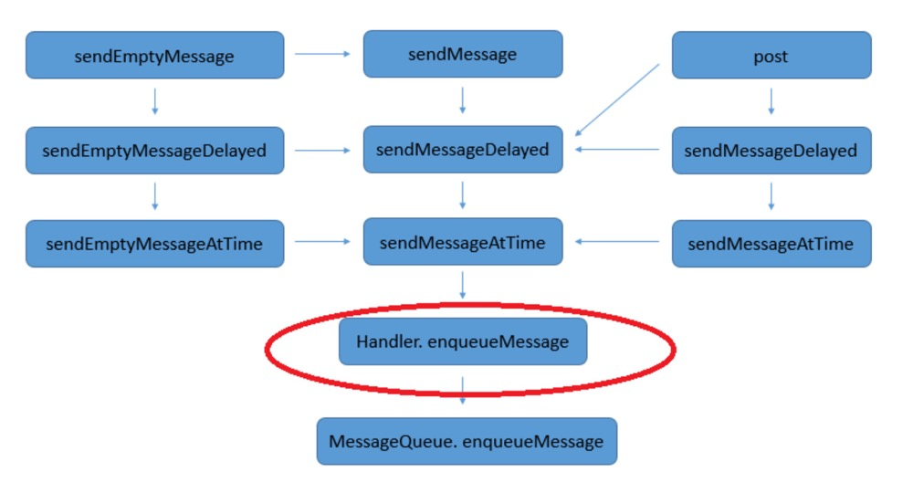

# Handler机制

### 一、Handler 机制

#### 1.1 简述

Handler将 Message 发送到Looper的消息队列中，即MessageQueue，Looper 通过loop方法循环调取 MessageQueue中的Message，处理Message，然后调用Message的target，即Handler 的dispatchMessage方法，将该消息回调给 handMessage 方法中，对UI进行处理操作。

Handler 通信实现的方案实际上是**内存共享的方案**。

#### 1.2 Handler

handler 通过调用SendMessage 方法，最终会调用 Handler.enqueueMessage方法，Handler.enqueueMessage会调用MessageQueue的enqueueMessage方法。

handler 主要函数：

#### 1.3 Looper

应用启动以后会调用 ActivityThread 的main 方法，在main方法里面会调用 Looper. prepareMainLooper  和 Looper.loop 方法。如果在子线程中开启一个looper 需要先调用 Looper.prepare 方法，然后调用 Looper.loop 方法。

在Looper.prepare方法中会调用 ThreadLocal （线程隔离工具类）进行looper 的创建

#### 1.4 MessageQueue

messageQueue 属于一个容器，不属于某个线程。

##### 1.4.1 MessageQueue.enqueueMessage方法

向消息队列中添加消息，添加的时候使用  synchronized 同步锁，或者说内置锁进行操作，保证向 MessageQueue 中添加消息的时候只能同时存在一个线程。

##### 1.4.2 MessageQueue.next方法

循环从消息队列中取消息，采用 for（,,）循环的方式，此方法也添加了  synchronized 同步锁。

#### 1.5 ThreadLocal

作用：当某些数据是以线程为作用域并且不同线程具有不同的数据副本的时候，可以考虑采用 ThreadLocal 。

### 二、面试问题

#### 2.1 一个线程有几个 Handler？

一个线程可以有N多个Handler，看你创建多少个。

#### 2.2 一个线程有几个 Looper？如何保证？

一个线程只能有一个Looper，

#### 2.3 Handler 内存泄漏原因？ 为什么其他的内部类没有说过有这个问题？

内部类持有外部类的引用导致了内存泄露，如果 Activity 在退出的时候，MessageQueue 中还有一个 Message 未执行，这个 Message 持有了Handler 的引用，而 Handler 持有了Activity 的引用，导致 Activity 无法被回收，因此导致了内存泄露。可以使用 static 关键字，在 OnDestory 的时候将消息清除。

#### 2.4 为何主线程可以new Handler？如果想要在子线程中new Handler 要做些什么准备？

因为主线程在初始化的时候就已经对Looper 调用了Looper. prepareMainLooper  和 Looper.loop 方法；如果在子线程中new  Handler 需要调用 Looper.prepare 和 Looper.loop 方法。

#### 2.5 子线程中维护的Looper，消息队列无消息的时候的处理方案是什么？有什么用？

子线程创建了 looper，当没有消息的时候子线程将会被 block，无法被回收，所以我们需要手动调用 quit 方法将消息删除并且唤醒 looper，然后调用 next 方法返回null 退出 loop。

####  2.6 既然可以存在多个 Handler 往 MessageQueue 中添加数据（发消息时各个 Handler 可能处于不同线程），那它内部是如何确保线程安全的？

在添加数据和删除数据的时候都加了 this 锁，这样可以保证添加的位置是正确的，获取的位置也是最前面的。

#### 2.7 我们使用 Message 时应该如何创建它？

一般调用 Message.obtain 方法来进行创建。不推荐使用 new Message 的方法创建。

使用 Message.obtain 方法可以检查是否有可以复用的 Message，避免过多的创建、销毁 Message 对象，达到优化内存和性能的问题。

#### 2.8 Looper死循环为什么不会导致应用卡死

Looper 的 loop 方法是一个死循环，但是当没有消息的时候他会 block，ANR 是当我们处理点击事件 5s 内没有响应，或者 广播 10s 内没有响应，我们在处理点击事件的时候也是使用 Handler，所以一定有消息执行，并且 ANR 也是 Handler 发送的，所有不会阻塞主线程。

#### 2.9 Handler中线程是如何切换的？

内存是不分线程的。在子线程中执行的函数，这个函数就是在子线程里面，在主线程中执行的函数，这个函数就是在主线程里面。

在主线程中创建 Handler，在子线程中发送消息，消息放入到 MessageQueue 中，通过 Looper.loop 方法取出消息进行执行 handleMessage ， 由于looper.loop 在主线程中初始化的，所以在调用 handleMessage 的时候线程切入到主线程中。

#### 2.10 Android 中为什么非 UI 线程不能更新 UI？

在某些情况下，在子线程中是可以更新UI 的。但是在 ViewRootImpl 中对 UI 操作进行了 checkThread，但是我们在 OnCreate 和 onResume 方法中可以使用子线程更新UI，由于我们在 ActivityThread 中的 performResumeActivity 方法中通过 addView 创建了 viewRootImpl，这个行为是在 onResume 之后调用的，所以在 onCreate 和 onResume 方法中可以更新 UI。

但是我们不能在子线程中更新UI，因为如果添加了耗时操作之后，一旦 viewRootImpl 被创建将会被抛出异常。一旦在子线程中更新UI，容易发生问题。

#### 2.11 Handler 发送消息的 Delay 靠谱吗？

<mark>**所谓的延时指的是延时处理消息，不是延迟发送消息。**</mark>我们发送的消息都是立即插入到消息队列中去的。

#### 2.12 点击页面上的按钮后更新TextView的内容，谈谈你的理解？

这个问题是同步屏障的概念。

点击按钮的时候会发送消息到 handler，但是为了保证优先执行，会加一个标记异步，同时会发送一个 target == null 的消息，这样在从消息队列取消息的时候，如果发现消息的 next 方法为 null，那么会遍历消息队列将所有异步标记的消息取出来优先执行，执行完以后会将 target == null 的消息移除。

