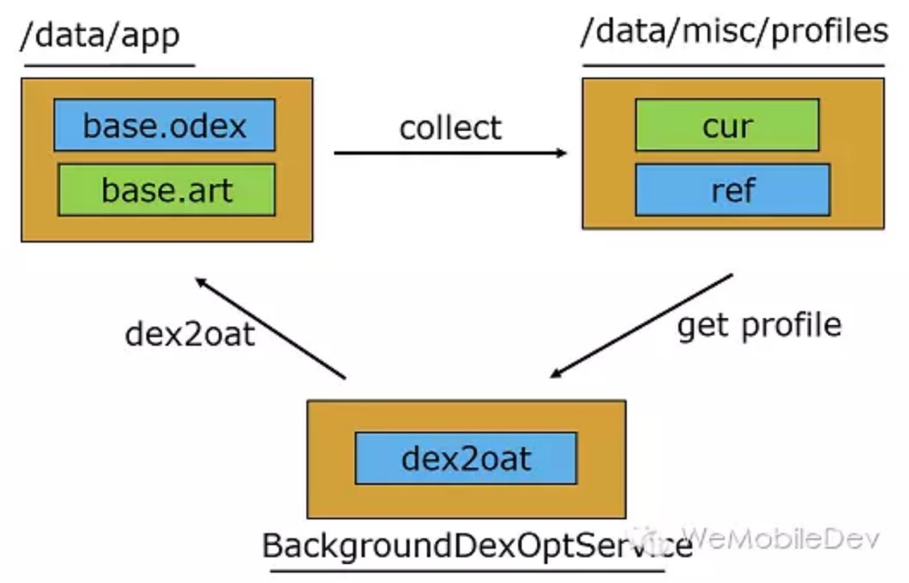
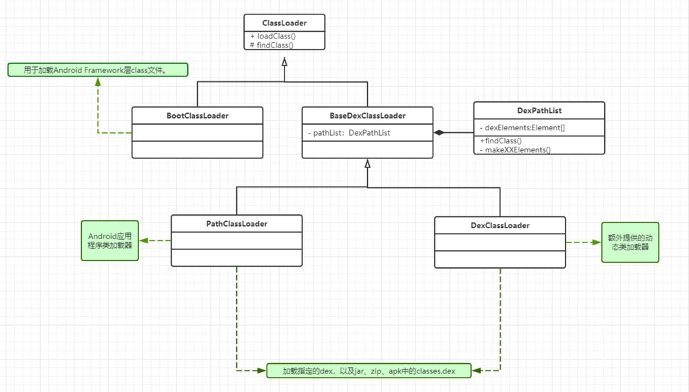
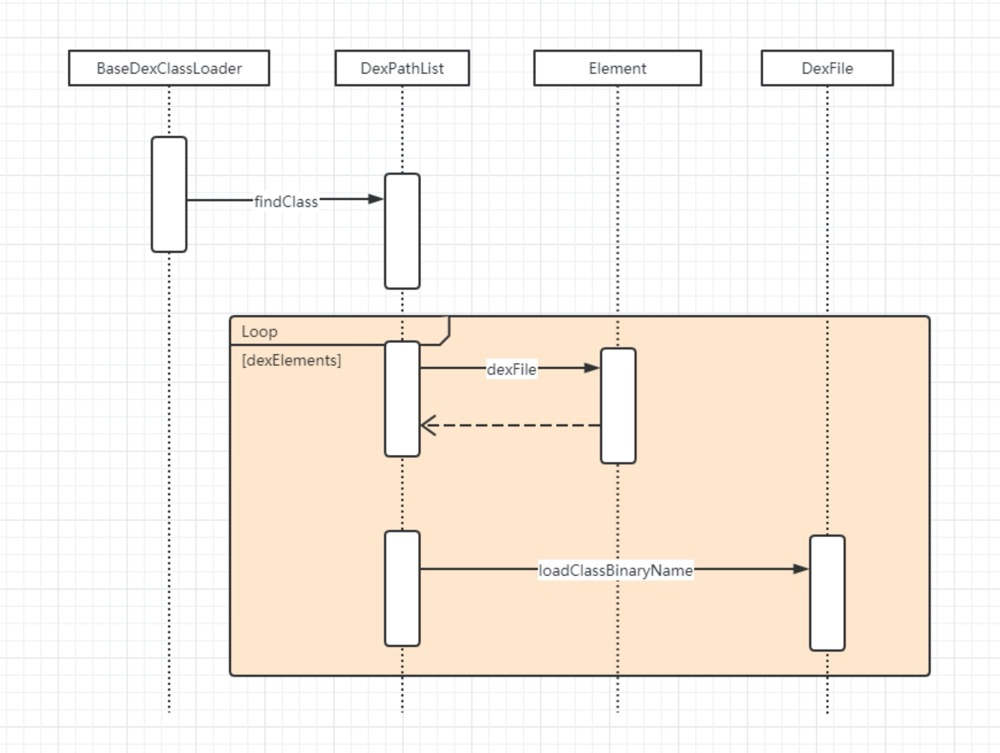

# 虚拟机与类加载机制

## 一、JVM与Dalvik

Android应用程序运行在Dalvik/ART虚拟机，并且每一个应用程序对应有一个单独的Dalvik虚拟机实例。Dalvik虚拟机实则也算是一个Java虚拟机，只不过它执行的不是class文件，而是dex文件。

Dalvik虚拟机与Java虚拟机共享有差不多的特性，差别在于两者执行的指令集是不一样的，前者的指令集是基本寄存器的，而后者的指令集是基于堆栈的。

## 二、ART与Dalvik

Dalvik 虚拟机执行的是 dex 字节码，解释执行。从Android 2.2版本开始，支持 <mark>JIT即时编译（Just in time）</mark>，在程序运行的过程中进行选择热点代码（经常执行的代码）进行编译或者优化。在Dalvik 下应用安装的过程，会执行一次优化，将 dex 字节码进行优化生存 odex 文件。

ART（Android Runtime）是在 Android 5.0 版本以后的出现的 Android 运行时。ART 虚拟机执行的是本地的机器码，在程序安装时会将字节码转化成机器码。ART 引入了<mark>预先编译机制（Ahead of Time）</mark>，在安装时，ART 使用设备自带的 dex2oat 工具来编译应用，dex 中的字节码将会被编译成机器码。Android 的运行时从 Dalvik 换成 ART 虚拟机，并不要求开发者将自己的应用直接编译成目标机器码，APK 仍然是一个包含 dex 的APK包。缺点是应用程序安装比较慢。

Android 7.0 混合使用AOT编译，解释和JIT。

1. 最初安装应用的时不进行任何AOT 编译（安装变快了），运行过程中解释执行，对经常执行的方法进行JIT，经过 JIT 编译的方法将会记录到 profle 配置文件中。
2. 当设备闲置或者充电的时候，编译守护进程会运行，根据 Profile 文件对常用代码进行 AOT 编译，待下次运行时直接使用。

## 三、双亲委托机制

某个类加载器在加载类时，首先将加载任务委托给父类加载器，依次递归，如果父类加载器可以完成加载任务，就成功返回；只有父类加载器无法完成加载任务或者没有父类的时候，才自己去加载。

优点：

1. 避免重复加载，当父类加载器已经加载了该类的时候，就没必要子 ClassLoader 再加载一次
2. 安全性考虑，防止核心 API 被随意篡改

