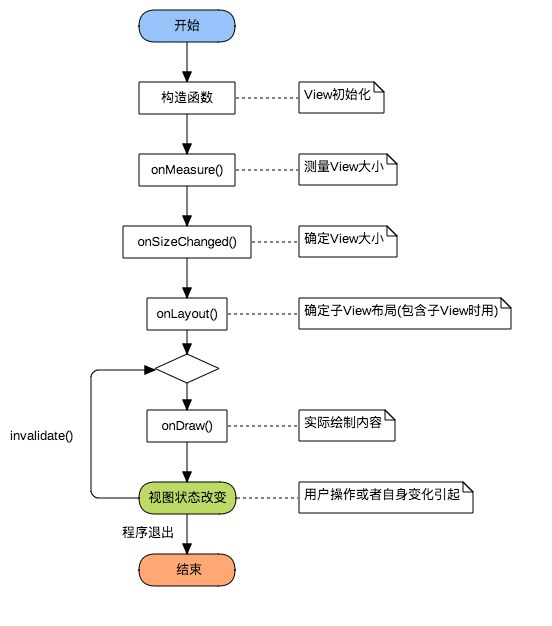
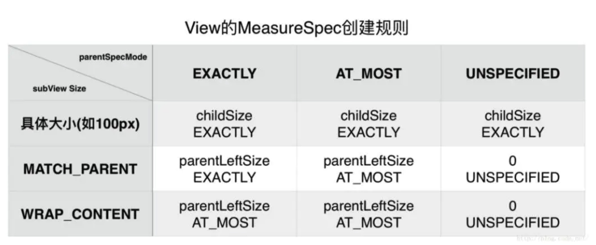

## View 绘制

#### 1. View绘制流程

View的绘制，有三个步骤：测量（measure），布局（layout），绘制（draw）, 从DecorView自上而下遍历整个View树，注意是所有View执行完一个步骤后，再进行下一步，而不是一个View执行完所有步骤再遍历下一个View。

各步骤的主要工作：

- Measure：测量视图大小。从顶层父View到子View递归调用measure方法，measure方法又回调OnMeasure。
- Layout：确定View位置，进行页面布局。从顶层父View向子View的递归调用view.layout方法的过程，即父View根据上一步measure子View所得到的布局大小和布局参数，将子View放在合适的位置上。
- 绘制视图。ViewRoot创建一个Canvas对象，然后调用OnDraw()。六个步骤：①、绘制视图的背景；②、保存画布的图层（Layer）；③、绘制View的内容；④、绘制View子视图，如果没有就不用；⑤、还原图层（Layer）；⑥、绘制滚动条。



#### 2. MeasureSpec是什么

MeasureSpec是Viw中的内部类，基本都是二进制运算。由于int是32位的，用高两位表示mode，低30位表示size，

其中，Mode模式共分为三类：

- EXACTLY：对应LayoutParams中的match_parent和具体数值这两种模式。检测到View所需要的精确大小，这时候View的最终大小就是SpecSize所指定的值，
- AT_MOST ：对应LayoutParams中的wrap_content。View的大小不能大于父容器的大小。
- UNSPECIFIED ：不对View进行任何限制，要多大给多大，一般用于系统内部，如ListView，ScrollView

#### 3. 自定义View 如何分类？

1. 自定义 View

MeasureSpec是View中的内部类，基本都是二进制运算。由于int是32位的，用高两位表示mode，低30位表示size，MODE_SHIFT = 30的作用是移位

2. 自定义 ViewGroup

MeasureSpec是View中的内部类，基本都是二进制运算。由于int是32位的，用高两位表示mode，低30位表示size，MODE_SHIFT = 30的作用是移位

#### 4. 子View创建MeasureSpec创建规则是什么

这个没啥好说的，理解+记忆这个表格，子View的MeasureSpec由父View根据自身的MeasureSpec和子View的LayoutParams来共同确定子View的MeasureSpec，注意，即使确定了子View的MeasureSpec并不一定决定了子View的大小，自定义View可以根据需要修改这个值，最终通过setMeasuredDimension（width,height）设置最终大小。



#### 5. 自定义 View wrap_content不起作用的原因


#### 6. 在Activity中获取某个View的宽高有几种方法

1. 重写Activity中的onWindowFocusChanged，当Activity获取到焦点的时候View已经绘制完成，也能获取到View的准确宽高了。

```
    @Override
    public void onWindowFocusChanged(boolean hasFocus) {
        super.onWindowFocusChanged(hasFocus);
        
    }
```


2. View.post(runnable) 。通过 post 将消息投递到消息队列的队尾，等 Looper 调用此消息的时候，View 已经初始化好了，此时可以获取到数据。

```
     binding.serviceRl.post(new Runnable() {
            @Override
            public void run() {

                binding.serviceRl.getHeight();
            }
        });
```


3. ViewTreeObserver

```
      ViewTreeObserver viewTreeObserver = binding.container.getViewTreeObserver();
        viewTreeObserver.addOnGlobalLayoutListener(new ViewTreeObserver.OnGlobalLayoutListener() {
            @Override
            public void onGlobalLayout() {
                binding.container.getViewTreeObserver().removeOnGlobalLayoutListener(this);
                binding.serviceRl.getHeight();
            }
        });
```


4. 

#### 7. 为什么onCreate获取不到View的宽高

在 onCreate 中 View 的绘制还没有完成，只有在 onWindowFocusChanged 方法执行的时候代表 View 已经绘制完成。

#### 8. View#post与Handler#post的区别


#### 9. Android绘制和屏幕刷新机制原理


#### 10.Choreography原理

#### 11. 什么是双缓冲

#### 12. 为什么使用SurfaceView

#### 13. 什么是SurfaceView

#### 14. View和SurfaceView的区别

#### 15. SurfaceView为什么可以直接子线程绘制

#### 16. SurfaceView、TextureView、SurfaceTexture、GLSurfaceView

#### 17. getWidth()方法和getMeasureWidth()区别

getMeasuredWidth()、getMeasuredHeight()必须在onMeasure之后使用才有效）getMeasuredWidth() 的取值最终来源于 setMeasuredDimension() 方法调用时传递的参数, getWidth()返回的是，mRight - mLeft，mRight、mLeft 变量分别表示 View 相对父容器的左右边缘位置，getWidth()与getHeight()方法必须在layout(int l, int t, int r, int b)执行之后才有效

#### 18. invalidate() 和 postInvalidate() 的区别

二者都会出发刷新View，并且当这个View的可见性为VISIBLE的时候，View的onDraw()方法将会被调用，invalidate()方法在 UI 线程中调用，重绘当前 UI。postInvalidate() 方法在非 UI 线程中调用，通过Handler通知 UI 线程重绘。

invadite()必须在主线程中调用，而postInvalidate()内部是由Handler的消息机制实现的，所以在任何线程都可以调用，但实时性没有invadite()强。但是一般为了保险起见，是使用postInvalidate()来刷新界面。

#### 19. Requestlayout，onlayout，onDraw，DrawChild区别与联系

#### 20. LinearLayout、FrameLayout 和 RelativeLayout 哪个效率高


#### 21. LinearLayout的绘制流程


#### 22. 自定义 View 的流程和注意事项

#### 23. 自定义View如何考虑机型适配

#### 24. 自定义控件优化方案

#### 25. invalidate怎么局部刷新

#### 26. View加载流程（setContentView）