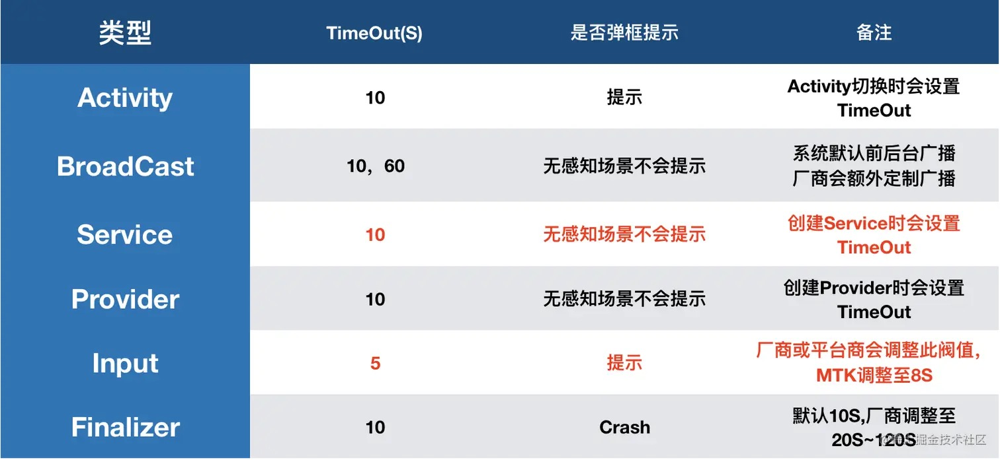

## 今日头条团队对ANR问题对外分享

首先是，2021年3月份，今日头条团队分享的ANR 优化实践系列文章：

- 《今日头条 ANR 优化实践系列 - 设计原理及影响因素》：[juejin.cn/post/694006…](https://juejin.cn/post/6940061649348853796)
- 《今日头条 ANR 优化实践系列 - 监控工具与分析思路》：[juejin.cn/post/694266…](https://juejin.cn/post/6942665216781975582)
- 《今日头条 ANR 优化实践系列分享 - 实例剖析集锦》：[juejin.cn/post/694526…](https://juejin.cn/post/6945267342671052807)
- 《今日头条 ANR 优化实践系列 - Barrier导致主线程假死》：[juejin.cn/post/694798…](https://juejin.cn/post/6947986170135445535)
- 《今日头条 ANR 优化实践系列 - 告别 SharedPreference 等待》：[juejin.cn/post/696196…](https://juejin.cn/post/6961961476047568932)

### 1.1 认识ANR

#### 1.1.1 系统如何处理ANR

设计原理和影响因素篇，主要对以下关键问题展开

- ANR触发的条件以及根本原因
- 发生ANR之后，系统处理ANR的流程。
- 应用层如何判定ANR：对ANR的感知，通过监听SIGQUIT信号。
- 应用层面如何获取有用的信息帮助解决ANR问题。

### ANR 设计原理

ANR 全称 Applicatipon No Response；Android 设计 ANR 的用意，是系统通过与之交互的组件(Activity，Service，Receiver，Provider)以及用户交互(InputEvent)进行超时监控，以判断应用进程(主线程)是否存在卡死或响应过慢的问题，通俗来说就是很多系统中看门狗(watchdog)的设计思想。

### 组件超时分类

系统在通过 Binder 通信向应用进程发送上述组件消息或 Input 事件时，在 AMS 或 Input 服务端同时设置一个异步超时监控。当然针对不同类型事件，设置的超时时长也存在差别，以下是 Android 系统对不同类型的超时阈值设置：

*(图片仅供参考，国内厂商可能会有调整，每个厂商的标准也存在差异)*

### ANR 信息获取：

继续以广播接收为例，在上面介绍到当判定超时后，会调用系统服务 AMS 接口，搜集本次 ANR 相关信息并存档(data/anr/trace，data/system/dropbox)

#### 1.1.2 ANR问题分类

把ANR 产生的影响因素清晰的分为了四个大的类别，基本覆盖了ANR问题产生的原因。

- 应用内主线程存在耗时任务；
- 应用主线程处理大量任务；
- 系统内部其他进程或者资源负载过高；
- 应用自身其他线程或者负载过高。

系列文章其实就是围绕着这些问题的监控、分析、解决展开的。

### 2 工具建设-消息调度监控

通过博文得知，今日头条团队，ANR 监控的工具叫 **Raster**，其最主要的功能就是采集主线程调度。

ANR 产生的原因很多情况下可能是历史耗时问题的累计。因而单纯采集发生ANR 时那一刻的堆栈就会有【堆栈漂移的问题】，也就是采集到的堆栈不是诱发ANR 产生的真正原因。现在ANR 监控的很多框架也是围绕这一问题展开的。

应对方式 **对主线程消息调度进行监控记录**，包括历史消息，正在执行的消息和将要执行的消息。同时对四大组件执行的消息进行单独的监控，这对我们分析哪个组件产生的ANR 是很重要的参考依据。

这一方案是在网上公开的我能接触到的最早提出的，后面我们会看到很多团队对ANR 问题的监控都是这一方案的变种，或者大同小异。

这一方案的细化，主要包括以下几个方面

#### 2.1 消息聚合

消息统计聚合策略：主线程消息会很多，记录过去5-10秒的消息本身是一个比较重的动作，采用一定的聚合策略是很有必要的。

- 合并耗时段的多个消息：耗时较小的消息，对ANR 问题的产生影响不大，只记录总耗时和和消息的个数。
- 独立组件消息：`ActivtyThread` 组件调度通过Handler我们可以采集到这些调度，单独记录。
- 独立耗时消息：对超过阈值（比如300ms）的消息单独记录，耗时消息是我们重点关注的对象。
- 记录IDEL 状态，主线程无消息的时候，会进入IDEL 状态，堵塞在`nativePoll` 处。这一状态单独统计。
- 发生ANR 时，采集当前正在进行的任务。
- ANR 发生时，采集pending消息，根据pending消息中的组件调度消息能让们知道哪个组件触发 ANR，同时根据等待的时常侧面反映系统负载的能力。

#### 2.2 每条消息记录的关键信息

- 消息调度的时长：cputime 和 walltime，记录两个时间能更好的判断一次消息耗时是执行耗时还是等待或者抢占较多。
- 消息调度的类型：组件调度，耗时调度，多消息聚合调度
- 消息堆栈：对消息内具体执行信息，采集其堆栈。 

#### 2.3 主线程线程堆栈的采样

对耗时的消息，进行采样，采取的策略是超时采样。具体来说，介于大部分的耗时小消息不需要进行堆栈采样，为了避免频繁设置和取消超时任务（也就是采样任务），头条在此处做了一个优化，每次消息开始是并不是重新设置采集超时任务，而是修改目标时间。

### 3 问题分析&解决

- 结合结合采集的物料，这些物料包括ANR Info信息，采集的主线程调度信息等给出了分析ANR问题的一般思路。通过trace信息读取是否有明显的耗时调用，通过ANR Info分析系统负载，应用内负载，再结合Raster采集的线程调用，把ANR问题最终归因上上述四大因素上。然后具体分析解决。这里不做展开了，今日头条团队案例分析还是相当精彩的不容错过。
- 对Barrier泄漏的监控和由SP引发的案例进行详细的分析。

