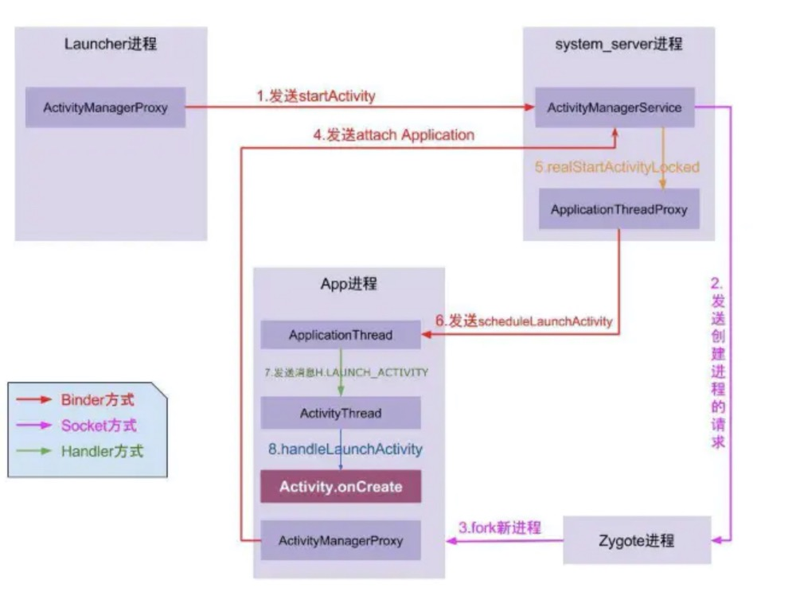
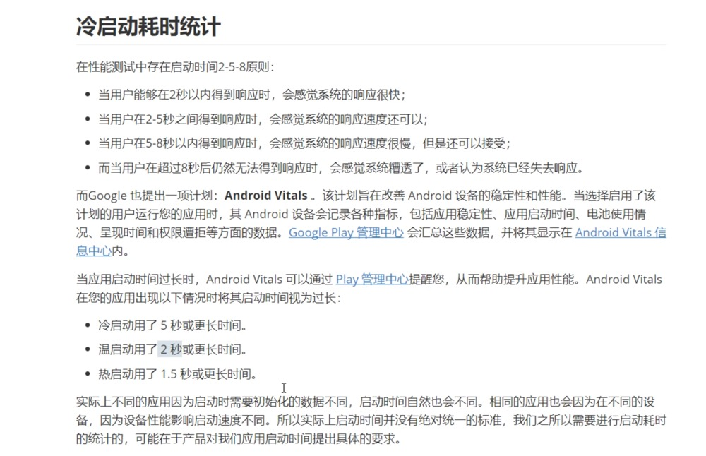

## 启动优化

### 一、启动流程

App启动流程，以及开发者可以优化的点是哪里？

①点击桌面App图标，Launcher进程采用Binder IPC向system_server进程发起startActivity请求；

②system_server进程接收到请求后，向zygote进程发送创建进程的请求；

③Zygote进程fork出新的子进程，即App进程；

④App进程，通过Binder IPC向sytem_server进程发起attachApplication请求；

⑤system_server进程在收到请求后，进行一系列准备工作后，再通过binder IPC向App进程发送scheduleLaunchActivity请求；

⑥App进程的binder线程（ApplicationThread）在收到请求后，通过handler向主线程发送LAUNCH_ACTIVITY消息；

⑦主线程在收到Message后，通过反射机制创建目标Activity，并回调Activity.onCreate()等方法。

⑧到此，App便正式启动，开始进入Activity生命周期，执行完onCreate/onStart/onResume方法，UI渲染结束后便可以看到App的主界面。

### 二、启动状态

1. 冷启动：
   	冷启动是指应用从头开始启动：系统进程在冷启动后才创建应用进程。发生冷启动的情况包括应用自设备启动后或系统终止应用后首次启动。 

2. 热启动：
   	在热启动中，系统的所有工作就是将 Activity 带到前台。只要应用的所有 Activity 仍驻留在内存中，应用就不必重复执行对象初始化、布局加载和绘制。

3. 温启动：
   	温启动包含了在冷启动期间发生的部分操作；同时，它的开销要比热启动高。有许多潜在状态可视为温启动。例如：

   用户在退出应用后又重新启动应用。进程可能未被销毁，继续运行，但应用需要执行 onCreate() 从头开始重新创建 Activity。
   系统将应用从内存中释放，然后用户又重新启动它。进程和 Activity 需要重启，但传递到 onCreate() 的已保存的实例savedInstanceState对于完成此任务有一定助益。
   ......

### 三、启动分析

使用**CPU Profile **进行分析启动。

| **类型**       | **作用**                                                     |
| -------------- | ------------------------------------------------------------ |
| Call Chart     | 根据时间线查看调用栈，便于观察每次调用是何时发生的           |
| Flame Chart    | 根据耗时百分比查看调用栈，便于发现总耗时很长的调用链         |
| Top Down Tree  | 查看记录数据中所有方法调用栈，便于观察其中每一步所消耗的精确时间。 |
| Bottom Up Tree | 相对于Top Down Tree，能够更方便查看耗时方法如何被调用        |

### 四、启动优化

1. 合理使用异步初始化、延迟初始化、懒加载机制
2. 启动过程避免耗时操作，如数据库、IO操作不要放在主线程进行
3. 类加载优化：提前异步执行类加载
4. 合理使用IdleHandler进行延迟初始化
5. 简化布局

IdleHandler作用：https://wetest.qq.com/lab/view/352.html

