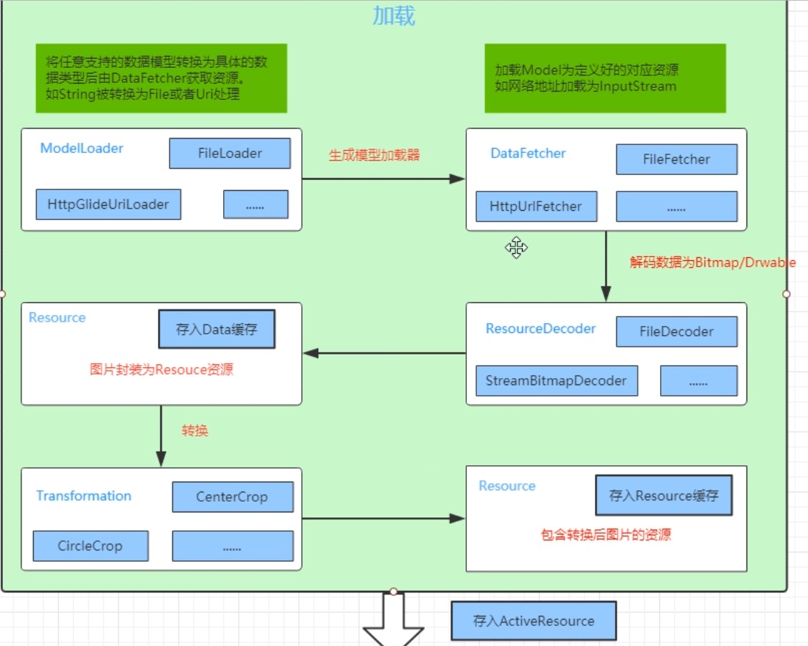

## Glide 源码解析

参考： 

1. https://juejin.cn/post/6844903986412126216
1. https://blog.csdn.net/xiaopangcame/article/details/118913626

### 1. Glide 如何管理生命周期

1. Glide在加载绑定了Activity的生命周期。
2. 在Activity内新建一个无UI的Fragment，这个特殊的Fragment持有一个  。通过Lifecycle在Fragment关键生命周期通知RequestManger进行相关的操作。
3. 在生命周期onStart时继续加载，onStop时暂停加载，onDestory是停止加载任务和清除操作。
   

### 2. Glide 四级缓存

先找内存缓存，再找文件缓存

1. 活动缓存（活动资源）：ActiveResource，弱引用缓存集合，里边使用一个弱引用weakHashMap来保存正在使用的图片，当我们加载图片的时候，先从activeResource里边去查找，如果找不到的话就从内存缓存里查找。理论上没有大小限制，但是因为是弱引用管理的，所以是可回收的。**存活于内存当中，非持久化**

2. 内存缓存：默认使用的是LRU的memoryCache，如果没有找到，将从文件缓存中查找。**存活于内存当中，非持久化。**与活动缓存是互斥的，如果在活动缓存中，则不会在内存缓存中出现。
3. 资源缓存（Resource）：该图片是否被解码，转码并写入过磁盘缓存，比如经过了圆角缩放处理的

4. 数据来源（Data）：原图缓存，从数据来源文件（未经过处理）里查找，**存活于磁盘中，持久化**

若这些缓存都找不到，会从网络上加载图片。

