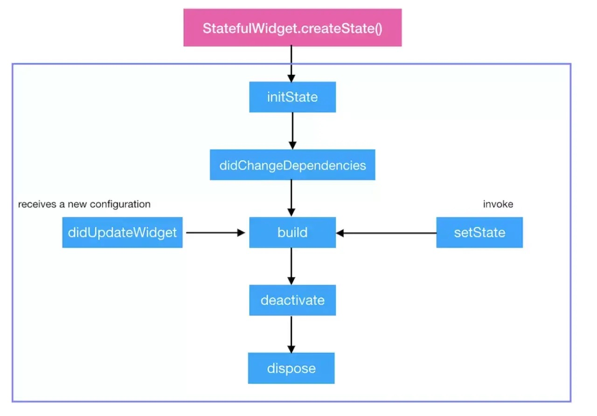

## Dart 面试

1. [老许，你要转Flutter不要？只要你开金口，面试题现在就给你送来](https://juejin.cn/post/6844904036076879880)
2. [Flutter 面试知识点集锦](https://juejin.cn/post/6844903843260530701)


**1. Dart 当中的 「..」表示什么意思？** Dart 当中的 「..」意思是 「级联操作符」，为了方便配置而使用。「..」和「.」不同的是 调用「..」后返回的相当于是 this，而「.」返回的则是该方法返回的值 。

**2. Dart 的作用域** Dart 没有 「public」「private」等关键字，默认就是公开的，私有变量使用 下划线 _开头。

**3. Dart 是不是单线程模型？是如何运行的？** Dart 是单线程模型，运行的的流程如下图。


简单来说，Dart 在单线程中是以消息循环机制来运行的，包含两个任务队列，一个是“微任务队列” microtask queue，另一个叫做“事件队列” event queue。

当Flutter应用启动后，消息循环机制便启动了。首先会按照先进先出的顺序逐个执行微任务队列中的任务，当所有微任务队列执行完后便开始执行事件队列中的任务，事件任务执行完毕后再去执行微任务，如此循环往复，生生不息。

**4. Dart 是如何实现多任务并行的？** 前面说过， Dart 是单线程的，不存在多线程，那如何进行多任务并行的呢？其实，Dart的多线程和前端的多线程有很多的相似之处。Flutter的多线程主要依赖Dart的并发编程、异步和事件驱动机制。


简单的说，在Dart中，一个Isolate对象其实就是一个isolate执行环境的引用，一般来说我们都是通过当前的isolate去控制其他的isolate完成彼此之间的交互，而当我们想要创建一个新的Isolate可以使用Isolate.spawn方法获取返回的一个新的isolate对象，两个isolate之间使用SendPort相互发送消息，而isolate中也存在了一个与之对应的ReceivePort接受消息用来处理，但是我们需要注意的是，ReceivePort和SendPort在每个isolate都有一对，只有同一个isolate中的ReceivePort才能接受到当前类的SendPort发送的消息并且处理。


**5. 说一下Dart异步编程中的 Future关键字？** 前面说过，Dart 在单线程中是以消息循环机制来运行的，其中包含两个任务队列，一个是“微任务队列” microtask queue，另一个叫做“事件队列” event queue。

在Java并发编程开发中，经常会使用Future来处理异步或者延迟处理任务等操作。而在Dart中，执行一个异步任务同样也可以使用Future来处理。在 Dart 的每一个 Isolate 当中，执行的优先级为 ： Main > MicroTask > EventQueue。

**6. 说一下Dart异步编程中的 Stream数据流？** 在Dart中，Stream 和 Future 一样，都是用来处理异步编程的工具。它们的区别在于，Stream 可以接收多个异步结果，而Future 只有一个。 Stream 的创建可以使用 Stream.fromFuture，也可以使用 StreamController 来创建和控制。还有一个注意点是：普通的 Stream 只可以有一个订阅者，如果想要多订阅的话，要使用 asBroadcastStream()。

**7. Stream 有哪两种订阅模式？分别是怎么调用的？** Stream有两种订阅模式：单订阅(single) 和 多订阅（broadcast）。单订阅就是只能有一个订阅者，而广播是可以有多个订阅者。这就有点类似于消息服务（Message Service）的处理模式。单订阅类似于点对点，在订阅者出现之前会持有数据，在订阅者出现之后就才转交给它。而广播类似于发布订阅模式，可以同时有多个订阅者，当有数据时就会传递给所有的订阅者，而不管当前是否已有订阅者存在。

Stream 默认处于单订阅模式，所以同一个 stream 上的 listen 和其它大多数方法只能调用一次，调用第二次就会报错。但 Stream 可以通过 transform() 方法（返回另一个 Stream）进行连续调用。通过 Stream.asBroadcastStream() 可以将一个单订阅模式的 Stream 转换成一个多订阅模式的 Stream，isBroadcast 属性可以判断当前 Stream 所处的模式。

**8. await for 如何使用？** await for是不断获取stream流中的数据，然后执行循环体中的操作。它一般用在直到stream什么时候完成，并且必须等待传递完成之后才能使用，不然就会一直阻塞。

```
Stream<String> stream = new Stream<String>.fromIterable(['不开心', '面试', '没', '过']);
main() async{
    await for(String s in stream){
    print(s);
  }
}
```

**9. 说一下 mixin机制？** mixin 是Dart 2.1 加入的特性，以前版本通常使用abstract class代替。简单来说，mixin是为了解决继承方面的问题而引入的机制，Dart为了支持多重继承，引入了mixin关键字，它最大的特殊处在于： mixin定义的类不能有构造方法，这样可以避免继承多个类而产生的父类构造方法冲突。

mixins的对象是类，mixins绝不是继承，也不是接口，而是一种全新的特性，可以mixins多个类，mixins的使用需要满足一定条件。


## Flutter

**1. 请简单介绍下Flutter框架，以及它的优缺点？** Flutter是Google推出的一套开源跨平台UI框架，可以快速地在Android、iOS和Web平台上构建高质量的原生用户界面。同时，Flutter还是Google新研发的Fuchsia操作系统的默认开发套件。在全世界，Flutter正在被越来越多的开发者和组织使用，并且Flutter是完全免费、开源的。Flutter采用现代响应式框架构建，其中心思想是使用组件来构建应用的UI。当组件的状态发生改变时，组件会重构它的描述，Flutter会对比之前的描述，以确定底层渲染树从当前状态转换到下一个状态所需要的最小更改。

**优点**

- 热重载（Hot Reload），利用Android Studio直接一个ctrl+s就可以保存并重载，模拟器立马就可以看见效果，相比原生冗长的编译过程强很多；
- 一切皆为Widget的理念，对于Flutter来说，手机应用里的所有东西都是Widget，通过可组合的空间集合、丰富的动画库以及分层课扩展的架构实现了富有感染力的灵活界面设计；
- 借助可移植的GPU加速的渲染引擎以及高性能本地代码运行时以达到跨平台设备的高质量用户体验。 简单来说就是：最终结果就是利用Flutter构建的应用在运行效率上会和原生应用差不多。

**缺点**

- 不支持热更新；
- 三方库有限，需要自己造轮子；
- Dart语言编写，增加了学习难度，并且学习了Dart之后无其他用处，相比JS和Java来说。

**2. 介绍下Flutter的理念架构** 其实也就是下面这张图。


由上图可知，Flutter框架自下而上分为Embedder、Engine和Framework三层。其中，Embedder是操作系统适配层，实现了渲染 Surface设置，线程设置，以及平台插件等平台相关特性的适配；Engine层负责图形绘制、文字排版和提供Dart运行时，Engine层具有独立虚拟机，正是由于它的存在，Flutter程序才能运行在不同的平台上，实现跨平台运行；Framework层则是使用Dart编写的一套基础视图库，包含了动画、图形绘制和手势识别等功能，是使用频率最高的一层。


**3. 介绍下FFlutter的FrameWork层和Engine层，以及它们的作用**

Flutter的FrameWork层是用Drat编写的框架（SDK），它实现了一套基础库，包含Material（Android风格UI）和Cupertino（iOS风格）的UI界面，下面是通用的Widgets（组件），之后是一些动画、绘制、渲染、手势库等。这个纯 Dart实现的 SDK被封装为了一个叫作 dart:ui的 Dart库。我们在使用 Flutter写 App的时候，直接导入这个库即可使用组件等功能。

Flutter的Engine层是Skia 2D的绘图引擎库，其前身是一个向量绘图软件，Chrome和 Android均采用 Skia作为绘图引擎。Skia提供了非常友好的 API，并且在图形转换、文字渲染、位图渲染方面都提供了友好、高效的表现。Skia是跨平台的，所以可以被嵌入到 Flutter的 iOS SDK中，而不用去研究 iOS闭源的 Core Graphics / Core Animation。Android自带了 Skia，所以 Flutter Android SDK要比 iOS SDK小很多。

**4. 介绍下Widget、State、Context 概念**

- **Widget**：在Flutter中，几乎所有东西都是Widget。将一个Widget想象为一个可视化的组件（或与应用可视化方面交互的组件），当你需要构建与布局直接或间接相关的任何内容时，你正在使用Widget。
- **Widget树**：Widget以树结构进行组织。包含其他Widget的widget被称为父Widget(或widget容器)。包含在父widget中的widget被称为子Widget。
- **Context**：仅仅是已创建的所有Widget树结构中的某个Widget的位置引用。简而言之，将context作为widget树的一部分，其中context所对应的widget被添加到此树中。一个context只从属于一个widget，它和widget一样是链接在一起的，并且会形成一个context树。
- **State**：定义了StatefulWidget实例的行为，它包含了用于”交互/干预“Widget信息的行为和布局。应用于State的任何更改都会强制重建Widget。

**5. 简述Widget的StatelessWidget和StatefulWidget两种状态组件类**

- **StatelessWidget**: 一旦创建就不关心任何变化，在下次构建之前都不会改变。它们除了依赖于自身的配置信息（在父节点构建时提供）外不再依赖于任何其他信息。比如典型的Text、Row、Column、Container等，都是StatelessWidget。它的生命周期相当简单：初始化、通过build()渲染。
- **StatefulWidget**: 在生命周期内，该类Widget所持有的数据可能会发生变化，这样的数据被称为State，这些拥有动态内部数据的Widget被称为StatefulWidget。比如复选框、Button等。State会与Context相关联，并且此关联是永久性的，State对象将永远不会改变其Context，即使可以在树结构周围移动，也仍将与该context相关联。当state与context关联时，state被视为已挂载。StatefulWidget由两部分组成，在初始化时必须要在createState()时初始化一个与之相关的State对象。

**6. StatefulWidget 的生命周期** Flutter的Widget分为StatelessWidget和StatefulWidget两种。其中，StatelessWidget是无状态的，StatefulWidget是有状态的，因此实际使用时，更多的是StatefulWidget。StatefulWidget的生命周期如下图。



*  **initState()**：Widget 初始化当前 State，在当前方法中是不能获取到 Context 的，如想获取，可以试试 Future.delayed()
* **didChangeDependencies()**：在 initState() 后调用，State对象依赖关系发生变化的时候也会调用。
* **deactivate()**：当 State 被暂时从视图树中移除时会调用这个方法，页面切换时也会调用该方法，和Android里的 onPause 差不多。
* **dispose()**：Widget 销毁时调用。
* **didUpdateWidget**：Widget 状态发生变化的时候调用。

**7. 简述Widgets、RenderObjects 和 Elements的关系** 首先看一下这几个对象的含义及作用。

- **Widget** ：仅用于存储渲染所需要的信息。
- **RenderObject** ：负责管理布局、绘制等操作。
- **Element** ：才是这颗巨大的控件树上的实体。

Widget会被inflate（填充）到Element，并由Element管理底层渲染树。Widget并不会直接管理状态及渲染,而是通过State这个对象来管理状态。Flutter创建Element的可见树，相对于Widget来说，是可变的，通常界面开发中，我们不用直接操作Element,而是由框架层实现内部逻辑。就如一个UI视图树中，可能包含有多个TextWidget(Widget被使用多次)，但是放在内部视图树的视角，这些TextWidget都是填充到一个个独立的Element中。Element会持有renderObject和widget的实例。记住，Widget 只是一个配置，RenderObject 负责管理布局、绘制等操作。

在第一次创建 Widget 的时候，会对应创建一个 Element， 然后将该元素插入树中。如果之后 Widget 发生了变化，则将其与旧的 Widget 进行比较，并且相应地更新 Element。重要的是，Element 不会被重建，只是更新而已。

**8. 什么是状态管理，你了解哪些状态管理框架？** Flutter中的状态和前端React中的状态概念是一致的。React框架的核心思想是组件化，应用由组件搭建而成，组件最重要的概念就是状态，状态是一个组件的UI数据模型，是组件渲染时的数据依据。

Flutter的状态可以分为全局状态和局部状态两种。常用的状态管理有ScopedModel、BLoC、Redux / FishRedux和Provider。详细使用情况和差异可以自行了解。

**9. 简述Flutter的绘制流程**

Flutter的绘制流程如下图所示。


Flutter只关心向 GPU提供视图数据，GPU的 VSync信号同步到 UI线程，UI线程使用 Dart来构建抽象的视图结构，这份数据结构在 GPU线程进行图层合成，视图数据提供给 Skia引擎渲染为 GPU数据，这些数据通过 OpenGL或者 Vulkan提供给 GPU。


**10. 简述Flutter的线程管理模型** 默认情况下，Flutter Engine层会创建一个Isolate，并且Dart代码默认就运行在这个主Isolate上。必要时可以使用spawnUri和spawn两种方式来创建新的Isolate，在Flutter中，新创建的Isolate由Flutter进行统一的管理。 事实上，Flutter Engine自己不创建和管理线程，Flutter Engine线程的创建和管理是Embeder负责的，Embeder指的是将引擎移植到平台的中间层代码，Flutter Engine层的架构示意图如下图所示。


在Flutter的架构中，Embeder提供四个Task Runner，分别是Platform Task Runner、UI Task Runner Thread、GPU Task Runner和IO Task Runner，每个Task Runner负责不同的任务，Flutter Engine不在乎Task Runner运行在哪个线程，但是它需要线程在整个生命周期里面保持稳定。

**11. Flutter 是如何与原生Android、iOS进行通信的？** Flutter 通过 PlatformChannel 与原生进行交互，其中 PlatformChannel 分为三种：

- **BasicMessageChannel** ：用于传递字符串和半结构化的信息。
- **MethodChannel** ：用于传递方法调用（method invocation）。
- **EventChannel** : 用于数据流（event streams）的通信。

同时 Platform Channel 并非是线程安全的 ，更多详细可查阅闲鱼技术的 [《深入理解Flutter Platform Channel》](https://link.juejin.cn?target=https%3A%2F%2Fwww.jianshu.com%2Fp%2F39575a90e820)


**12. 简述Flutter 的热重载** Flutter 的热重载是基于 JIT 编译模式的代码增量同步。由于 JIT 属于动态编译，能够将 Dart 代码编译成生成中间代码，让 Dart VM 在运行时解释执行，因此可以通过动态更新中间代码实现增量同步。

热重载的流程可以分为 5 步，包括：扫描工程改动、增量编译、推送更新、代码合并、Widget 重建。Flutter 在接收到代码变更后，并不会让 App 重新启动执行，而只会触发 Widget 树的重新绘制，因此可以保持改动前的状态，大大缩短了从代码修改到看到修改产生的变化之间所需要的时间。

另一方面，由于涉及到状态的保存与恢复，涉及状态兼容与状态初始化的场景，热重载是无法支持的，如改动前后 Widget 状态无法兼容、全局变量与静态属性的更改、main 方法里的更改、initState 方法里的更改、枚举和泛型的更改等。

可以发现，热重载提高了调试 UI 的效率，非常适合写界面样式这样需要反复查看修改效果的场景。但由于其状态保存的机制所限，热重载本身也有一些无法支持的边界。

