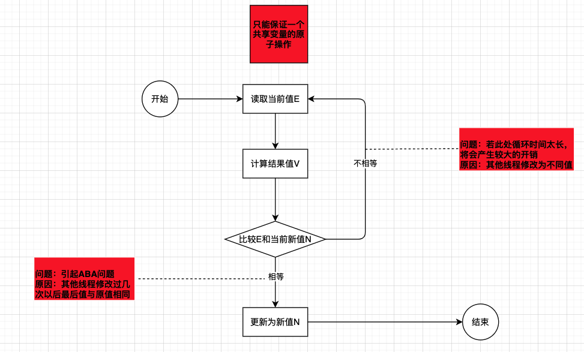

1. CAS是什么？
2. CAS带来的三大问题
    * ABA问题
    * 循环时间长开销大
    * 只能保证一个共享变量的原子操作

### 1. CAS是什么？
**CAS**：Compare and Swap，即比较再交换。

**CAS算法理解**：CAS是一种无锁算法，CAS有3个操作数，内存值E，旧的预期值V，要修改的新值N。当且仅当预期值V和内存值E相同时，将内存值E修改为N，否则什么都不做。

**CAS算法图解**：

上图描述了CAS的原理，以及带来的三大问题以及问题出现的位置。

### 2. CAS带来的三大问题

#### 1.ABA问题
因为CAS需要在操作值的时候，检查值有没有发生变化，如果没有发生变化则更新，但是如果一个值原来是A，变成了B，又变成了A，那么CAS进行检查的时候发现它的值没有发生变化，但是实际上却变化了。ABA问题的解决思路就是使用版本号。在变量前面加上版本号，每次变量更新的时候把版本号加1，那么A->B->A就会变成1A->2B->3A。从Java 1.5开始，JDK的Atomic包里提供了一个类AtomicStampedReference来解决ABA问题。这个类的compareAndSet方法的作用是首先检查当前引用是否等于预期引用，并且检查当前的标志是否等于预期标志，如果全部相等，则以原子方式将该应用和该标志的值设置为给定的更新值。

#### 2.循环时间长开销大
自旋CAS如果长时间不成功，会给CPU带来非常大的执行开销，如果JVM能支持处理器提供的pause指令，那么效率会有一定的提升。pause指令有两个作用：第一，它可以延迟流水线执行指令（de-pipeline），使CPU不会消耗过多的执行资源，延迟的时间取决于具体实现的版本，在一些处理器上延迟时间是零；第二，它可以避免在循环的时候因内存顺序冲突（Memory Order Violation）而引起CPU流水线被清空，从而提高CPU的实行效率。

#### 3.只能保证一个共享变量的原子操作
当对一个共享变量执行操作时，我们可以使用循环CAS的方式来保证原子操作，但是对多个共享变量操作时，循环CAS就无法保证操作的原子性，这个时候可以用锁。还有一个取巧的办法，就是把多个共享变量合并成一个共享变量来操作。比如，有两个共享变量i=2,j=a,合并一下ji=2a,然后用CAS来操作ij。从Java 1.5开始，JDK提供了AtomicReference类来保证引用对象之前的原子性，就可以把多个变量放在一个对象里来进行CAS操作。

参考：

https://www.jianshu.com/p/ab2c8fce878b
[https://www.jianshu.com/p/68f9cd012de8](https://www.jianshu.com/p/68f9cd012de8)