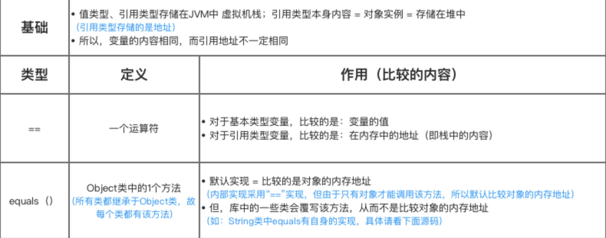

## String 

### 1.String 为什么是不可变的

由于效率和安全性问题 String 被设计为不可变的。不可变就是第二次给一个 String  变量赋值的时候，不是在原内存地址上修改数·据，而是重新指向一个新对象，新地址。

#### 效率

##### 1. 从内存角度看

字符串常量池的要求：创建字符串时，如果该字符串已经存在于池中，则将返回现有字符串的引用，而不是创建新对象。多个String变量引用指向同一个内存地址。如果字符串是可变的，用一个引用更改字符串将导致其他引用的值错误。这是很危险的。

##### 2. 缓存 hashCode

字符串的Hashcode在java中经常配合基于散列的集合一起正常运行，这样的散列集合包括HashSet、HashMap以及HashTable。不可变的特性保证了hashcode 永远是相同的。不用每次使用hashcode就需要计算hashcode。这样更有效率。因为当向集合中插入对象时，是通过hashcode判别在集合中是否已经存在该对象了（不是通过equals方法逐个比较，效率低）。

##### 3. 方便其它类使用

其他类的设计基于string不可变，如set存储string，改变该string后set包含了重复值。

#### 安全性

String被广泛用作许多java类的参数，例如网络连接、打开文件等。如果对string的某一处改变一不小心就影响了该变量所有引用的表现，则连接或文件将被更改，这可能导致严重的安全威胁。 不可变对象不能被写，所以不可变对象自然是线程安全的，因为不可变对象不能更改，它们可以在多个线程之间自由共享。

### 2.String 类的常用方法


### 3. equals()与==的区别

Equals 比较的是字符串序列

“==” 比较的是内存中存放的位置



```
public static void main(String[] args) {

        String str1 = "a" + "b" + "c";
        String str2 = "abc";
        String str3 = new String("abc");

        System.out.println(str1 == str2); // true
        System.out.println(str1 == str3); //false
        System.out.println(str2 == str3); //false
        System.out.println(str1.equals(str2)); //true
        System.out.println(str2.equals(str3));//true
        System.out.println(str1.equals(str3));//true
        System.out.println(str1.hashCode()+" "+str2.hashCode()+" "+str3.hashCode());//true
    }
```


结果分析：


### 4. String、StringBuffer 与 StringBuilder的区别


参考

1. https://www.jianshu.com/p/f23fec94c5fb
2. https://baijiahao.baidu.com/s?id=1715877727875768880&wfr=spider&for=pc