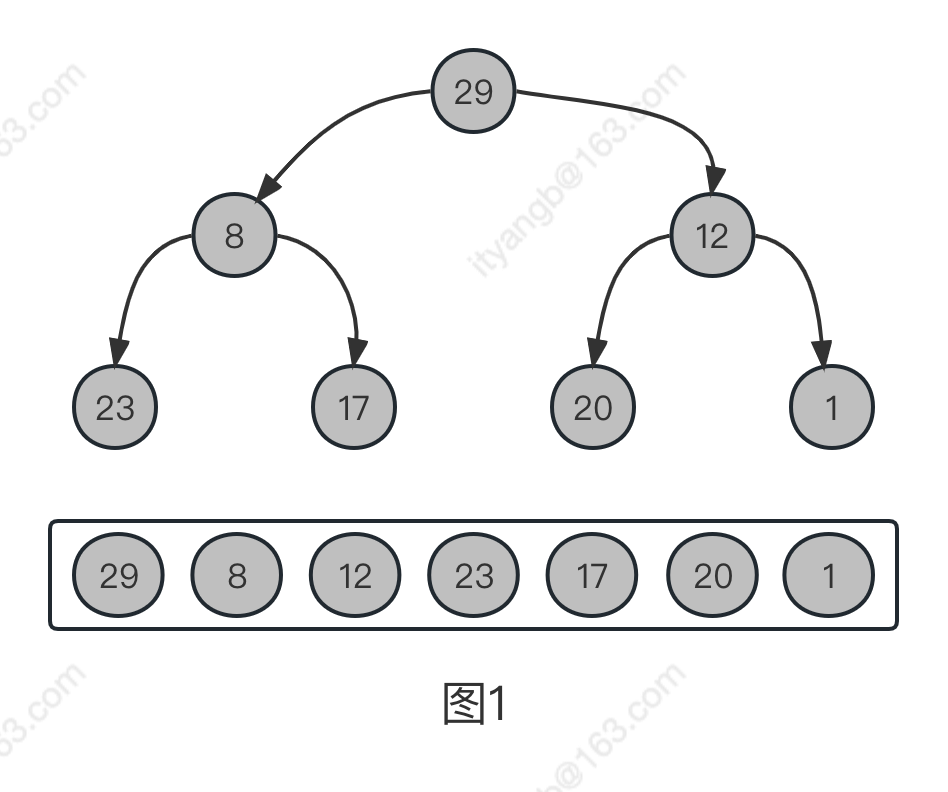

## 1. 堆排序概念

#### 堆：符合以下两个条件之一的完全二叉树：

* 根节点的值 ≥ 子节点的值，这样的堆被称之为最大堆，或大顶堆；
* 根节点的值 ≤ 子节点的值，这样的堆被称之为最小堆，或小顶堆。

#### 堆排序过程如下：

* 用数列构建出一个大顶堆，取出堆顶的数字；

* 调整剩余的数字，构建出新的大顶堆，再次取出堆顶的数字；

* 循环往复，完成整个排序。

  

  整体的思路就是这么简单，我们需要解决的问题有两个：

#### 如何用数列构建出一个大顶堆；
取出堆顶的数字后，如何将剩余的数字调整成新的大顶堆。

构建大顶堆有两种方式：

* 方案一：从 0 开始，将每个数字依次插入堆中，一边插入，一边调整堆的结构，使其满足大顶堆的要求；
* 方案二：将整个数列的初始状态视作一棵完全二叉树，自底向上调整树的结构，使其满足大顶堆的要求。

在介绍堆排序具体实现之前，我们先要了解完全二叉树的几个性质。将根节点的下标视为 0，则完全二叉树有如下性质：

* 对于完全二叉树中的第 i 个数，它的左子节点下标：left = 2i + 1
* 对于完全二叉树中的第 i 个数，它的右子节点下标：right = left + 1
* 对于有 n 个元素的完全二叉树(n≥2)，它的最后一个非叶子结点的下标：n/2 - 1

## 2. 构建过程

**将数组{29,8,20,23,17,12,1} 升序排列。**

### 2.1 初始化堆

* <mark>初始化堆其实就是把数组按照中序遍历的方式进行排列</mark>

例如数组{29,8,12,23,17,20,1} ，堆化以后如图1:

因为此处为升序排列，所以将数组的元素转化为大顶堆。若为降序排列，则转化为小顶堆。

* 数组索引为 i ii 的元素的左右叶子节点的索引分别是2 ∗ i + 1 2 * i + 12∗i+1 和 2 ∗ i + 2 2 * i + 22∗i+2，我们可以把数组转化为图1的树，这个是初始化的数据
* 图1中最后一个父节点是 12，它不满足大根堆的条件，因为它的子节点的值20 比它大，所以我们交换他们的值得到图2，当前的节点就满足大根堆了，然后继续下一个节点
* 往前继续找到父节点8（也就是从最右的父节点一直往前遍历），它不满足大根堆的条件，因为它的子节点的值23 比它大，所以交换 8  和 23 得到图3，然后继续下一个节点
* 下一父节点是29，它的值比两个子节点的值都大，已经满足大根堆的条件了，建堆完成
  

### 2.2 堆化第一步

大顶堆构建完成以后，当前拿到的数据为 {29,23,20,8,17,12,1},以这个为基础开始堆化第一步。

