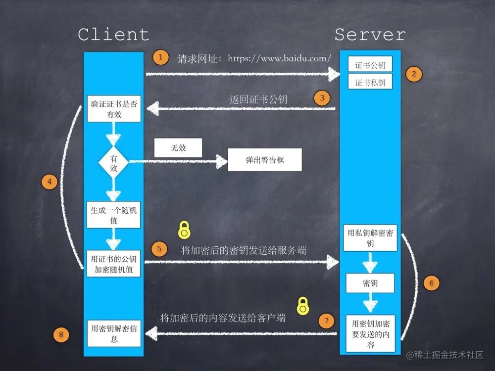

### 1. http 各个版本的区别？

[版本区别（文档）](https://www.jianshu.com/p/d3d897dc0693)

[版本区别（ 视频）](https://www.bilibili.com/video/BV1s34y1S7bT/?spm_id_from=333.788.recommend_more_video.8&vd_source=021679df8281240a9eeb5964293fd33c)

#### 0.9版本

**特点：**

1.  最早出现的一个版本
2.  只支持 GET 请求
3. 只支持传输 HTML 的数据格式
4.  无状态性（客户端发送请求，服务端接受请求并返回结果给客户端后，客户端和服务端的链接会马上断开）

**缺点：**

1. 只支持 GET 方法单一
2.  只支持服务端返回 HTML

#### 1.0 版本

1.0 的版本出现是为了解决 0.9 版本的缺陷问题
 **优点： **

1. 支持 GET  POST 和 HEAD
2.  支持传入多种数据格式（视频、图片、二进制等）
3.  新增状态码、缓存等

**缺点：**

1. 一个 TCP 链接只能发送一个请求

#### 1.1 版本

1.1 版本的出现是为了解决 1.0 版本的缺陷
**优点：**

1. 持久性连接，即 TCP 连接不关闭，可以被多个请求复用
2.  管道机制（同一个 TCP 连接，客户端可以同时发送多个请求）
3.  新增了一些请求方法： PUT DELETE OPTIONS

**缺点：**

1. 会造成队头阻塞问题（虽然同一个TCP 可以同时发送多个请求，但是服务端还是会一个一个请求进行处理进行返回，如果上一个返回延迟，会阻塞后面的流程）

#### 2.0 版本

**优点：**

1. 二进制传输（1.1 版本是通过文本进行传输，内容不能分开传递，2.0版本将请求的数据转换成二进制格式，然后标记索引，将数据包分成一片一片，相当于并发传输数据给到服务端）
2.  多路复用（多个请求通过一个 TCP 连接）
3.  头部压缩  （多个请求中，可能会存在相同的请求头，于是在客户端和服务端维护一张静态表，通过索引来将多个请求中的请求字段合并，传递时，只需传递索引即可）
4.  服务器端推送（浏览器刚请求 HTML 时，就会把可能用到的 CSS JS 发送给客户端，减少等待的延迟）

**缺点：**

1. 队头阻塞

#### 3.0 版本

3.0 不同于以往的版本，基于谷歌的QUIC，底层是基于 UDP 协议
**优点：**

1. 基于UDP，提高了传输效率，降低延迟（没有三次握手和四次挥手）
2.  使用stream进一步扩展HTTP2.0 的多路复用，传输多少文件就可以产生多少stream，若发生丢包，只需要传输丢失的stream

### 2. http 和 https 的区别？

1. https协议需要到ca申请证书，一般免费证书较少，因而需要一定费用。
2.  http是超文本传输协议，信息是明文传输，https则是具有安全性的ssl加密传输协议。
3. http和https使用的是完全不同的连接方式，用的端口也不一样，前者是80，后者是443。
4. http的连接很简单，是无状态的；HTTPS协议是由SSL+HTTP协议构建的可进行加密传输、身份认证的网络协议，比http协议安全。

### 3. https 传输过程

[HTTPS加密过程和TLS证书验证](https://juejin.cn/post/6844903545272041479)

二者都是网络传输协议;`HTTPS`在传输过程中是可以通过加密来保护数据安全的，以免用户敏感信息被第三方获取。 可以说`HTTPS`是`HTTP`的升级版、安全版。下面我们就简单看下HTTPS的加密过程，先看下图。

1. ***客户端发起`HTTPS`请求*** 这个没什么好说的，就是用户在浏览器里输入一个`HTTPS`网址，然后连接到服务端的443端口。

2. ***服务端的配置*** 采用`HTTPS`协议的服务器必须要有一套数字证书，可以自己制作，也可以向组织申请。区别就是自己颁发的证书需要客户端验证通过，才可以继续访问，而使用受信任的公司申请的证书则不会弹出提示页面。这套证书其实就是一对公钥和私钥。如果对公钥不太理解，可以想象成一把钥匙和一个锁头，只是世界上只有你一个人有这把钥匙，你可以把锁头给别人，别人可以用这个锁把重要的东西锁起来，然后发给你，因为只有你一个人有这把钥匙，所以只有你才能看到被这把锁锁起来的东西。

3. ***传送证书*** 这个证书其实就是公钥，只是包含了很多信息，如证书的颁发机构，过期时间等等。

4. ***客户端解析证书*** 这部分工作是由客户端的SSL/TLS来完成的，首先会验证公钥是否有效，比如颁发机构，过期时间等等，如果发现异常，则会弹出一个警示框，提示证书存在的问题。如果证书没有问题，那么就生成一个***随机值***。然后用证书（也就是公钥）对这个随机值进行加密。就好像上面说的，把随机值用锁头锁起来，这样除非有钥匙，不然看不到被锁住的内容。

5. ***传送加密信息*** 这部分传送的是用证书加密后的随机值，目的是让服务端得到这个随机值，以后客户端和服务端的通信就可以通过这个随机值来进行加密解密了。

6. ***服务端解密信息*** 服务端用私钥解密后，得到了客户端传过来的随机值，然后把内容通过该随机值进行对称加密，将信息和私钥(随机值)通过某种算法混合在一起，这样除非知道私钥，不然无法获取内容，而正好客户端和服务端都知道这个私钥，所以只要加密算法够彪悍，私钥够复杂，数据就够安全。

7. ***传输加密后的信息*** 这部分信息就是服务端用私钥加密后的信息，可以在客户端用随机值解密还原。

8. ***客户端解密信息*** 客户端用之前生产的私钥解密服务端传过来的信息，于是获取了解密后的内容。整个过程第三方即使监听到了数据，也束手无策。

### 4. TCP三次握手、TCP四次挥手

[三次握手、四次挥手](https://juejin.cn/post/6844903958624878606)

### 5. 服务端返回的 code 码代表的含义

RFC 规定 HTTP 的状态码为**三位数**，被分为五类:

- **1xx**: 表示目前是协议处理的中间状态，还需要后续操作。
- **2xx**: 表示成功状态。
- **3xx**: 重定向状态，资源位置发生变动，需要重新请求。
- **4xx**: 请求报文有误。
- **5xx**: 服务器端发生错误。

#### 1xx

**101 Switching Protocols**。在`HTTP`升级为`WebSocket`的时候，如果服务器同意变更，就会发送状态码 101。

#### 2xx

**200 OK**是见得最多的成功状态码。通常在响应体中放有数据。

**204 No Content**含义与 200 相同，但响应头后没有 body 数据。

**206 Partial Content**顾名思义，表示部分内容，它的使用场景为 HTTP 分块下载和断点续传，当然也会带上相应的响应头字段`Content-Range`。

#### 3xx

**301 Moved Permanently**即永久重定向，对应着**302 Found**，即临时重定向。

比如你的网站从 HTTP 升级到了 HTTPS 了，以前的站点再也不用了，应当返回`301`，这个时候浏览器默认会做缓存优化，在第二次访问的时候自动访问重定向的那个地址。

而如果只是暂时不可用，那么直接返回`302`即可，和`301`不同的是，浏览器并不会做缓存优化。

**304 Not Modified**: 当协商缓存命中时会返回这个状态码。详见[浏览器缓存](https://link.juejin.cn?target=http%3A%2F%2F47.98.159.95%2Fmy_blog%2Fperform%2F001.html)

#### 4xx

**400 Bad Request**: 开发者经常看到一头雾水，只是笼统地提示了一下错误，并不知道哪里出错了。

**403 Forbidden**: 这实际上并不是请求报文出错，而是服务器禁止访问，原因有很多，比如法律禁止、信息敏感。

**404 Not Found**: 资源未找到，表示没在服务器上找到相应的资源。

**405 Method Not Allowed**: 请求方法不被服务器端允许。

**406 Not Acceptable**: 资源无法满足客户端的条件。

**408 Request Timeout**: 服务器等待了太长时间。

**409 Conflict**: 多个请求发生了冲突。

**413 Request Entity Too Large**: 请求体的数据过大。

**414 Request-URI Too Long**: 请求行里的 URI 太大。

**429 Too Many Request**: 客户端发送的请求过多。

**431 Request Header Fields Too Large**请求头的字段内容太大。

#### 5xx

**500 Internal Server Error**: 仅仅告诉你服务器出错了，出了啥错咱也不知道。

**501 Not Implemented**: 表示客户端请求的功能还不支持。

**502 Bad Gateway**: 服务器自身是正常的，但访问的时候出错了，啥错误咱也不知道。

**503 Service Unavailable**: 表示服务器当前很忙，暂时无法响应服务。

[面试官系列 - https 真的安全吗，可以抓包吗，如何防止抓包吗](https://mp.weixin.qq.com/s/k4QnLPpeNq_p_LzVykzJ1A)

