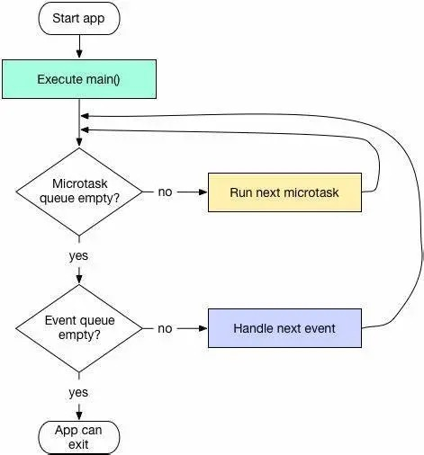

三棵树，channel 通信原理，内存分配，启动模式，单例，flutter单线程模型，动画分类，线程池，handler，锁，provider getx 状态库的比对，性能优化，flutter 和原生对比，feature 和ioslate，

## Flutter

### 1.三棵树

- **Widget** ：仅用于存储渲染所需要的信息。
- **RenderObject** ：负责管理布局、绘制等操作。
- **Element** ：才是这颗巨大的控件树上的实体。

Widget会被inflate（填充）到Element，并由Element管理底层渲染树。Widget并不会直接管理状态及渲染,而是通过State这个对象来管理状态。Flutter创建Element的可见树，相对于Widget来说，是可变的，通常界面开发中，我们不用直接操作Element,而是由框架层实现内部逻辑。就如一个UI视图树中，可能包含有多个TextWidget(Widget被使用多次)，但是放在内部视图树的视角，这些TextWidget都是填充到一个个独立的Element中。Element会持有renderObject和widget的实例。记住，Widget 只是一个配置，RenderObject 负责管理布局、绘制等操作。

在第一次创建 Widget 的时候，会对应创建一个 Element， 然后将该元素插入树中。如果之后 Widget 发生了变化，则将其与旧的 Widget 进行比较，并且相应地更新 Element。重要的是，Element 不会被重建，只是更新而已。

### 2.Flutter 单线程模型



简单来说，Dart 在单线程中是以消息循环机制来运行的，包含两个任务队列，一个是“微任务队列” microtask queue，另一个叫做“事件队列” event queue。

当Flutter应用启动后，消息循环机制便启动了。首先会按照先进先出的顺序逐个执行微任务队列中的任务，当所有微任务队列执行完后便开始执行事件队列中的任务，事件任务执行完毕后再去执行微任务，如此循环往复，生生不息。

### 3.Flutter动画分类

1. Hero动画

应用于 **元素共享** 的动画。

下面这三个图片详情案例的使用方式，将 Widget 从 A页面 **共享到** B页面 后，改变Widget大小，被称为 **标准 hero 动画**；

2. 交错动画

   有些时候我们可能会需要一些复杂的动画，这些动画可能由一个动画序列或重叠的动画组成，比如：有一个柱状图，需要在高度增长的同时改变颜色，等到增长到最大高度后，我们需要在X轴上平移一段距离。可以发现上述场景在不同阶段包含了多种动画，要实现这种效果，使用交织动画（Stagger Animation）会非常简单。交织动画需要注意以下几点：

   1. 要创建交织动画，需要使用多个动画对象（`Animation`）。
   2. 一个`AnimationController`控制所有的动画对象。
   3. 给每一个动画对象指定时间间隔（Interval）

3. 页面转场动画
   在自定义路由时，添加动画，自定义路由需要用到PageRouteBuilder<T>；

4. Tween({this.begin,this.end}) 两个构造参数，分别是 开始值 和 结束值，根据这两个值，提供了控制动画的方法，以下是常用的；

   controller.forward() : 向前，执行 begin 到 end 的动画，执行结束后，处于end状态；
   controller.reverse() : 反向，当动画已经完成，进行还原动画；
   controller.reset() : 重置，当动画已经完成，进行还原，注意这个是直接还原，没有动画；

### 4.provider、getX状态库对比

在 Flutter 开发中，状态管理是一个重要的话题，有多种状态管理库可供选择，其中 `provider` 和 `GetX` 是两种常用的库。下面是对这两者的详细对比。

### Provider

`provider` 是 Flutter 官方推荐的状态管理库，基于 InheritedWidget 构建。它提供了一种简洁、灵活且高效的方式来管理状态和依赖注入。

#### 优点

1. **简单易用**：Provider 易于理解和使用，特别是对于小型和中型项目。
2. **官方支持**：作为 Flutter 官方推荐的状态管理库，Provider 有很好的文档和社区支持。
3. **灵活性**：可以组合使用多个 Provider 来管理复杂的状态。
4. **高性能**：由于 Provider 基于 InheritedWidget，性能非常高效，不会导致不必要的重建。

#### 缺点

1. **模板代码多**：在大型项目中，可能会有较多的模板代码，需要手动定义和管理多个 Provider。
2. **学习曲线**：对于初学者来说，理解 InheritedWidget 和 ChangeNotifier 可能有一定的学习曲线。

#### 示例

```
dart
复制代码
import 'package:flutter/material.dart';
import 'package:provider/provider.dart';

void main() {
  runApp(
    ChangeNotifierProvider(
      create: (context) => Counter(),
      child: MyApp(),
    ),
  );
}

class Counter with ChangeNotifier {
  int _count = 0;
  int get count => _count;

  void increment() {
    _count++;
    notifyListeners();
  }
}

class MyApp extends StatelessWidget {
  @override
  Widget build(BuildContext context) {
    return MaterialApp(
      home: Scaffold(
        appBar: AppBar(title: Text('Provider Example')),
        body: Center(
          child: Column(
            mainAxisAlignment: MainAxisAlignment.center,
            children: <Widget>[
              Text('You have pushed the button this many times:'),
              Consumer<Counter>(
                builder: (context, counter, child) {
                  return Text('${counter.count}', style: Theme.of(context).textTheme.headline4);
                },
              ),
            ],
          ),
        ),
        floatingActionButton: FloatingActionButton(
          onPressed: () => context.read<Counter>().increment(),
          tooltip: 'Increment',
          child: Icon(Icons.add),
        ),
      ),
    );
  }
}
```

### GetX

`GetX` 是一个功能强大且多功能的库，不仅用于状态管理，还包括依赖注入和路由管理。它以其简洁性和高性能而闻名。

#### 优点

1. **多功能**：GetX 集成了状态管理、依赖注入和路由管理，提供了一站式解决方案。
2. **简洁代码**：相比于 Provider，GetX 的语法更加简洁，减少了模板代码。
3. **高性能**：GetX 使用惰性加载和细粒度的状态更新，性能非常高效。
4. **响应式编程**：GetX 支持响应式编程模型，使得状态更新和 UI 刷新更直观。

#### 缺点

1. **过度依赖**：GetX 集成了太多功能，可能导致项目过度依赖于这个库，一旦 GetX 有重大变更或停止维护，会对项目造成较大影响。
2. **学习曲线**：虽然 GetX 语法简单，但由于其多功能性，对于初学者来说可能需要一些时间来掌握。

#### 示例

```
dart
复制代码
import 'package:flutter/material.dart';
import 'package:get/get.dart';

void main() {
  runApp(MyApp());
}

class CounterController extends GetxController {
  var count = 0.obs;
  void increment() => count++;
}

class MyApp extends StatelessWidget {
  @override
  Widget build(BuildContext context) {
    return GetMaterialApp(
      home: Scaffold(
        appBar: AppBar(title: Text('GetX Example')),
        body: Center(
          child: Column(
            mainAxisAlignment: MainAxisAlignment.center,
            children: <Widget>[
              Text('You have pushed the button this many times:'),
              Obx(() {
                final counter = Get.find<CounterController>();
                return Text('${counter.count}', style: Theme.of(context).textTheme.headline4);
              }),
            ],
          ),
        ),
        floatingActionButton: FloatingActionButton(
          onPressed: () => Get.find<CounterController>().increment(),
          tooltip: 'Increment',
          child: Icon(Icons.add),
        ),
      ),
    );
  }
}

class CounterBinding extends Bindings {
  @override
  void dependencies() {
    Get.put(CounterController());
  }
}
```

### 对比总结

| 特性           | Provider                        | GetX                                   |
| -------------- | ------------------------------- | -------------------------------------- |
| **状态管理**   | 简单易用，基于 InheritedWidget  | 功能强大，支持响应式编程               |
| **依赖注入**   | 需要单独使用其他库              | 内置依赖注入机制                       |
| **路由管理**   | 需要使用 Flutter 自带的路由管理 | 内置路由管理                           |
| **学习曲线**   | 官方支持，文档详尽              | 简单直接，但功能多需要学习             |
| **性能**       | 高效，适合大多数情况            | 高效，适合复杂场景                     |
| **社区和支持** | 官方推荐，社区活跃              | 社区活跃，文档和示例丰富               |
| **代码简洁性** | 需要编写较多模板代码            | 语法简洁，减少模板代码                 |
| **应用规模**   | 适合中小型应用                  | 适合中大型应用，特别是需要多功能的应用 |

选择 `Provider` 还是 `GetX`，取决于具体项目需求和开发团队的偏好。对于简单的项目，`Provider` 是一个很好的选择；而对于需要高度灵活性和多功能支持的项目，`GetX` 提供了更多的可能性。

### 5.Flutter 与 原生对比

### 6.future 和ioslate

前面说过，Dart 在单线程中是以消息循环机制来运行的，其中包含两个任务队列，一个是“微任务队列” microtask queue，另一个叫做“事件队列” event queue。

在Java并发编程开发中，经常会使用Future来处理异步或者延迟处理任务等操作。而在Dart中，执行一个异步任务同样也可以使用Future来处理。在 Dart 的每一个 Isolate 当中，执行的优先级为 ： Main > MicroTask > EventQueue。

前面说过， Dart 是单线程的，不存在多线程，那如何进行多任务并行的呢？其实，Dart的多线程和前端的多线程有很多的相似之处。Flutter的多线程主要依赖Dart的并发编程、异步和事件驱动机制。


简单的说，在Dart中，一个Isolate对象其实就是一个isolate执行环境的引用，一般来说我们都是通过当前的isolate去控制其他的isolate完成彼此之间的交互，而当我们想要创建一个新的Isolate可以使用Isolate.spawn方法获取返回的一个新的isolate对象，两个isolate之间使用SendPort相互发送消息，而isolate中也存在了一个与之对应的ReceivePort接受消息用来处理，但是我们需要注意的是，ReceivePort和SendPort在每个isolate都有一对，只有同一个isolate中的ReceivePort才能接受到当前类的SendPort发送的消息并且处理。

### 7.channel 通信原理

## Android

### 1.启动模式

我们每次打开一个新的Activity或者退出当前Activity都会在一个称为任务栈的结构中添加或者减少一个Activity组件，

一个任务栈包含了一个activity的集合。

android通过ActivityRecord、TaskRecord、ActivityStack，ActivityStackSupervisor，ProcessRecord有序地管理每

个activity。

**1. Standard**

默认模式，每次启动Activity都会创建一个新的Activity实例。

**2. SingleTop**

通知消息打开的页面

如果要启动的Activity已经在栈顶，则不会重新创建Activity，只会调用该该Activity的onNewIntent()方法。

如果要启动的Activity不在栈顶，则会重新创建该Activity的实例。

**3. SingleTask**

主界面

如果要启动的Activity已经存在于它想要归属的栈中，那么不会创建该Activity实例，将栈中位于该Activity上的所有的

Activity出栈，同时该Activity的onNewIntent()方法会被调用。

**4. SingleInstance**

呼叫来电界面

要创建在一个新栈，然后创建该Activity实例并压入新栈中，新栈中只会存在这一个Activity实例。

**5. singleInstancePerTask**

`singleInstancePerTask`的作用和`singleTask`几乎一模一样，*不过singleInstancePerTask不需要为启动的Activity设置一个特殊的taskAffinity就可以创建新的task*，换句话讲就是设置`singleInstancePerTask`模式的`activity`可以存在于多个task任务栈中，并且在每个任务栈中是单例的。

多次启动设置singleInstancePerTask模式的Activity并不会多次创建新的任务栈，而是如singleInstance模式一样，把当前Activity所在的任务栈置于前台展示，如果想每次以新的任务栈启动需要设置`FLAG_ACTIVITY_MULTIPLE_TASK`和`FLAG_ACTIVITY_NEW_DOCUMENT`

### 2.单例设计模式

[单例设计模式](https://github.com/Ityang/Architect/blob/main/%E8%AE%BE%E8%AE%A1%E6%A8%A1%E5%BC%8F/%E5%8D%95%E4%BE%8B%E8%AE%BE%E8%AE%A1%E6%A8%A1%E5%BC%8F.md)

### 3.Handler机制

完成。

### 4.线程池

#### 面试问题1：Java的线程池说一下，各个参数的作用，如何进行的?

```
public ThreadPoolExecutor(int corePoolSize, int maximumPoolSize,long 						    keepAliveTime,TimeUnit unit,
   BlockingQueue<Runnable> workQueue,
   ThreadFactory threadFactory,
   RejectedExecutionHandler handler) 
```

几个核心参数的作用：

- **corePoolSize：** 线程池核心线程数最大值
- **maximumPoolSize：** 线程池最大线程数大小
- **keepAliveTime：** 线程池中非核心线程空闲的存活时间大小
- **unit：** 线程空闲存活时间单位
- **workQueue：** 存放任务的阻塞队列
- **threadFactory：** 用于设置创建线程的工厂，可以给创建的线程设置有意义的名字，可方便排查问题。
- **handler：**  线城池的饱和策略事件，主要有四种类型。


#### 面试问题2：按线程池内部机制，当提交新任务时，有哪些异常要考虑。 


#### 面试问题3：线程池都有哪几种工作队列？

* ArrayBlockingQueue
* LinkedBlockingDeque
* DelayQueue
* PriorityBlockingQueue
* SynchronousQueu

##### ArrayBlockingQueue

ArrayBlockingQueue（有界队列）是一个用数组实现的有界阻塞队列，按FIFO排序量。

##### LinkedBlockingQueue

LinkedBlockingQueue（可设置容量队列）基于链表结构的阻塞队列，按FIFO排序任务，容量可以选择进行设置，不设置的话，将是一个无边界的阻塞队列，最大长度为Integer.MAX_VALUE，吞吐量通常要高于ArrayBlockingQuene；newFixedThreadPool线程池使用了这个队列

##### DelayQueue

DelayQueue（延迟队列）是一个任务定时周期的延迟执行的队列。根据指定的执行时间从小到大排序，否则根据插入到队列的先后排序。newScheduledThreadPool线程池使用了这个队列。

##### PriorityBlockingQueue

PriorityBlockingQueue（优先级队列）是具有优先级的无界阻塞队列；

##### SynchronousQueue

SynchronousQueue（同步队列）一个不存储元素的阻塞队列，每个插入操作必须等到另一个线程调用移除操作，否则插入操作一直处于阻塞状态，吞吐量通常要高于LinkedBlockingQuene，newCachedThreadPool线程池使用了这个队列。
针对面试题：线程池都有哪几种工作队列？ 我觉得，回答以上几种ArrayBlockingQueue，LinkedBlockingQueue，SynchronousQueue等，说出它们的特点，并结合使用到对应队列的常用线程池(如newFixedThreadPool线程池使用LinkedBlockingQueue)，进行展开阐述， 就可以啦。

#### 面试问题4：使用无界队列的线程池会导致内存飙升吗？

**会的，newFixedThreadPool使用了无界的阻塞队列LinkedBlockingQueue，如果线程获取一个任务后，任务的执行时间比较长(比如，上面demo设置了10秒)，会导致队列的任务越积越多，导致机器内存使用不停飙升，** 最终导致OOM。

#### 面试问题5：说说几种常见的线程池及使用场景

* newFixedThreadPool (固定数目线程的线程池)
* newCachedThreadPool(可缓存线程的线程池)
* newSingleThreadExecutor(单线程的线程池)
* newScheduledThreadPool(定时及周期执行的线程池)

#### 1. newFixedThreadPool

```
 public static ExecutorService newFixedThreadPool(int nThreads, ThreadFactory threadFactory) {
        return new ThreadPoolExecutor(nThreads, nThreads,
                                      0L, TimeUnit.MILLISECONDS,
                                      new LinkedBlockingQueue<Runnable>(),
                                      threadFactory);
    }
```

##### 线程池特点：

- 核心线程数和最大线程数大小一样
- 没有所谓的非空闲时间，即keepAliveTime为0
- 阻塞队列为无界队列LinkedBlockingQueue

##### 使用场景

FixedThreadPool 适用于处理CPU密集型的任务，确保CPU在长期被工作线程使用的情况下，尽可能的少的分配线程，即适用执行长期的任务。

#### 2. newCachedThreadPool

```
 public static ExecutorService newCachedThreadPool(ThreadFactory threadFactory) {
        return new ThreadPoolExecutor(0, Integer.MAX_VALUE,
                                      60L, TimeUnit.SECONDS,
                                      new SynchronousQueue<Runnable>(),
                                      threadFactory);
    
```

##### 线程池特点：

核心线程数为0
最大线程数为Integer.MAX_VALUE
阻塞队列是SynchronousQueue
非核心线程空闲存活时间为60秒

当提交任务的速度大于处理任务的速度时，每次提交一个任务，就必然会创建一个线程。极端情况下会创建过多的线程，耗尽 CPU 和内存资源。由于空闲 60 秒的线程会被终止，长时间保持空闲的 CachedThreadPool 不会占用任何资源。

##### 使用场景

用于并发执行大量短期的小任务。

#### newSingleThreadExecutor

```
public static ExecutorService newSingleThreadExecutor(ThreadFactory threadFactory) {
        return new FinalizableDelegatedExecutorService
            (new ThreadPoolExecutor(1, 1,
                                    0L, TimeUnit.MILLISECONDS,
                                    new LinkedBlockingQueue<Runnable>(),
                                    threadFactory));
    }
```

##### 线程池特点

- 核心线程数为1
- 最大线程数也为1
- 阻塞队列是LinkedBlockingQueue
- keepAliveTime为0

##### 使用场景

适用于串行执行任务的场景，一个任务一个任务地执行。

#### 4.newScheduledThreadPool

```
复制代码    public ScheduledThreadPoolExecutor(int corePoolSize) {
        super(corePoolSize, Integer.MAX_VALUE, 0, NANOSECONDS,
              new DelayedWorkQueue());
    }
```

##### 线程池特点

- 最大线程数为Integer.MAX_VALUE
- 阻塞队列是DelayedWorkQueue
- keepAliveTime为0
- scheduleAtFixedRate() ：按某种速率周期执行
- scheduleWithFixedDelay()：在某个延迟后执行

##### 使用场景

周期性执行任务的场景，需要限制线程数量的场景

### 5.锁

在 Java 中，有几种类型的锁用于控制对共享资源的访问和管理并发操作。这些锁的类型包括：

1. **Synchronized 锁**：Java 中最基本的锁机制之一。通过 synchronized 关键字可以对代码块或方法进行加锁，确保同一时间只有一个线程可以访问被加锁的代码块或方法。它是一种悲观锁，当一个线程获取了锁，其他线程必须等待该线程释放锁才能执行。

   ```
   javaCopy code
   synchronized void synchronizedMethod() {
       // 一些需要同步的操作
   }
   ```

2. **ReentrantLock**：ReentrantLock 是 java.util.concurrent 包中提供的可重入锁。与 synchronized 不同，ReentrantLock 提供了更多的灵活性，如可中断锁、定时锁、公平锁等。使用该锁需要手动控制锁的获取和释放。

   ```
   javaCopy code
   ReentrantLock lock = new ReentrantLock();
   lock.lock(); // 获取锁
   try {
       // 一些需要同步的操作
   } finally {
       lock.unlock(); // 释放锁
   }
   ```

3. **ReadWriteLock**：ReadWriteLock 是一个接口，它定义了读锁和写锁，允许多个线程同时读取共享资源，但只允许一个线程写入共享资源。ReentrantReadWriteLock 是 ReadWriteLock 接口的实现类。

   ```
   javaCopy code
   ReentrantReadWriteLock lock = new ReentrantReadWriteLock();
   Lock readLock = lock.readLock(); // 获取读锁
   Lock writeLock = lock.writeLock(); // 获取写锁
   readLock.lock(); // 获取读锁
   // 读取共享资源
   readLock.unlock(); // 释放读锁
   ```

4. **StampedLock**：Java 8 引入的StampedLock提供了乐观锁的机制，允许多个线程同时读取共享资源，同时支持对共享资源的独占访问。

   ```
   javaCopy code
   StampedLock lock = new StampedLock();
   long stamp = lock.readLock(); // 获取乐观读锁
   // 读取共享资源
   lock.unlockRead(stamp); // 释放乐观读锁
   ```

这些锁机制在不同的情况下有不同的适用性，开发者可以根据需求选择合适的锁来确保线程安全性并提高程序的并发性能。

synchronized 是 Java 中最常用的锁机制之一，用于实现多线程同步访问共享资源。它基于 Java 对象头中的锁标记位来实现锁的获取和释放。下面是 synchronized 实现锁的原理：

1. **对象监视器（Monitor）**：每个 Java 对象都与一个内部的监视器相关联，也称为监视器锁。当一个线程尝试进入 synchronized 代码块时，它会尝试获取该对象的监视器。
2. **锁的获取和释放**：当线程进入 synchronized 代码块时，它会尝试获取对象的监视器锁。如果没有其他线程持有相同对象的监视器锁，该线程将成功获取锁，并且其他线程将被阻塞直到该线程执行完 synchronized 代码块并释放锁。
3. **互斥性**：synchronized 锁具有互斥性，即同一时间只有一个线程可以获取对象的锁，其他线程必须等待锁释放后才能获取锁并执行同步代码块。
4. **可重入性**：同一个线程可以多次获取同一个对象的监视器锁，即可重入锁的特性。当线程已经持有锁时，可以多次进入它所持有的 synchronized 代码块而不会被阻塞。
5. **释放锁**：当线程退出 synchronized 代码块或方法时，会自动释放持有的锁。如果发生异常，也会自动释放锁，以防止死锁情况的发生。

实现原理涉及到 JVM 对对象头的管理以及在编译时生成字节码时的 monitorenter 和 monitorexit 指令，这些指令用于获取和释放对象的监视器锁。synchronized 的原理保证了多线程之间对共享资源的安全访问，确保了线程安全性。

需要注意的是，synchronized 锁是隐式锁，它的粒度是对象级别的。也就是说，当多个线程访问同一对象的不同 synchronized 方法或代码块时，它们会相互竞争同一个锁。若要实现更细粒度的控制，可以考虑使用 ReentrantLock 等显式锁机制。

### 6.内存优化

### 7.性能优化

### 8.Android 动画分类

