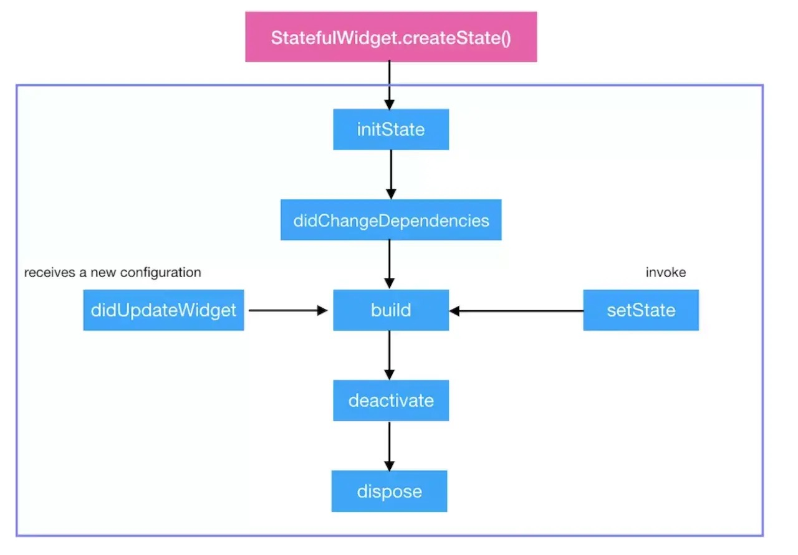

## 面试公司6

### 1. dart 是值传递还是引用传递？

在 Dart 中，虽然函数参数传递是通过值传递（pass by value）进行的，但对于引用类型和基本数据类型有着不同的行为。以下示例展示了值传递和引用传递的不同之处：

#### 1. 对于基本数据类型（值传递）：

基本数据类型在 Dart 中是通过值传递的，函数内部对参数的修改不会影响到原始值。

```
void modifyNumber(int number) {
  number = 20; // 修改参数副本的值
}

void main() {
  int originalNumber = 10;
  modifyNumber(originalNumber); // 传递值，原始值不受影响
  print(originalNumber); // 输出：10
}
```

#### 2. 对于引用类型（引用传递）：

引用类型在 Dart 中是通过引用传递的，函数参数实际上传递的是对象的引用，因此函数内部对参数的修改会影响到原始对象。

```
void modifyList(List<int> list) {
  list.add(4); // 修改原始对象
}

void main() {
  List<int> originalList = [1, 2, 3];
  modifyList(originalList); // 传递引用，原始对象被修改
  print(originalList); // 输出：[1, 2, 3, 4]
}
```

在引用类型的情况下，函数内部对参数的修改会影响到原始对象，因为函数接收的是对象的引用，所以对对象的操作会作用于原始对象上。

这个例子展示了 Dart 中值传递和引用传递的不同之处，基本数据类型是通过值传递的，而引用类型是通过引用传递的。

### 2. StatefulWidget的生命周期

Flutter的Widget分为StatelessWidget和StatefulWidget两种。其中，StatelessWidget是无状态的，StatefulWidget是有状态的，因此实际使用时，更多的是StatefulWidget。StatefulWidget的生命周期如下图。



*  **initState()**：Widget 初始化当前 State，在当前方法中是不能获取到 Context 的，如想获取，可以试试 Future.delayed()
*  **didChangeDependencies()**：在 initState() 后调用，State对象依赖关系发生变化的时候也会调用。
*  **deactivate()**：当 State 被暂时从视图树中移除时会调用这个方法，页面切换时也会调用该方法，和Android里的 onPause 差不多。
*  **dispose()**：Widget 销毁时调用。
*  **didUpdateWidget**：Widget 状态发生变化的时候调用。

### 3. mixin extends implement之间的关系

在Flutter中，有如下三种关系：

1. 继承（关键字 extends）
2. 混入 mixins （关键字 with）
3. 接口实现（关键字 implements）

这三种关系可以同时存在，但是有前后顺序：

extends ->  mixins -> implements

extens在前，mixins在中间，implements最后

### 4. 说一下 mixin机制

 mixin 是Dart 2.1 加入的特性，以前版本通常使用abstract class代替。简单来说，mixin是为了解决继承方面的问题而引入的机制，Dart为了支持多重继承，引入了mixin关键字，它最大的特殊处在于： mixin定义的类不能有构造方法，这样可以避免继承多个类而产生的父类构造方法冲突。

mixins的对象是类，mixins绝不是继承，也不是接口，而是一种全新的特性，可以mixins多个类，mixins的使用需要满足一定条件。

### 5. StatelessWidget和StatefulWidget的区别

- **StatelessWidget**: 一旦创建就不关心任何变化，在下次构建之前都不会改变。它们除了依赖于自身的配置信息（在父节点构建时提供）外不再依赖于任何其他信息。比如典型的Text、Row、Column、Container等，都是StatelessWidget。它的生命周期相当简单：初始化、通过build()渲染。
- **StatefulWidget**: 在生命周期内，该类Widget所持有的数据可能会发生变化，这样的数据被称为State，这些拥有动态内部数据的Widget被称为StatefulWidget。比如复选框、Button等。State会与Context相关联，并且此关联是永久性的，State对象将永远不会改变其Context，即使可以在树结构周围移动，也仍将与该context相关联。当state与context关联时，state被视为已挂载。StatefulWidget由两部分组成，在初始化时必须要在createState()时初始化一个与之相关的State对象。

### 6. Flutter 是如何与原生Android、iOS进行通信的？

Flutter 通过 PlatformChannel 与原生进行交互，其中 PlatformChannel 分为三种：

- **BasicMessageChannel** ：用于传递字符串和半结构化的信息。
- **MethodChannel** ：用于传递方法调用（method invocation）。
- **EventChannel** : 用于数据流（event streams）的通信。

同时 Platform Channel 并非是线程安全的 ，更多详细可查阅闲鱼技术的 [《深入理解Flutter Platform Channel》](https://link.juejin.cn?target=https%3A%2F%2Fwww.jianshu.com%2Fp%2F39575a90e820)

### 7. Text 如何处理字数过长

在 Flutter 中，可以使用 `Text` Widget 来显示文本内容，但当文本内容过长时可能会超出可见范围，这时可以使用一些属性和小部件来处理长文本显示。

以下是处理长文本的一些方法：

#### 1. 使用 `overflow` 属性：

`Text` Widget 提供了 `overflow` 属性，用于控制文本超出部分的显示方式。

```
dartCopy code
Text(
  'Long text here...',
  overflow: TextOverflow.ellipsis, // 文本超出部分显示省略号
)
```

#### 2. 使用 `maxLines` 属性：

`maxLines` 属性用于限制文本的最大行数。

```
dartCopy code
Text(
  'Long text here...',
  maxLines: 2, // 限制文本显示的最大行数
)
```

#### 3. 使用 `softWrap` 属性：

`softWrap` 属性控制文本是否自动换行。

```
dartCopy code
Text(
  'Long text here...',
  softWrap: true, // 允许文本自动换行
)
```

#### 4. 使用 `Expanded` 和 `Flexible` 等布局小部件：

将 `Text` 放置在 `Row`、`Column` 或 `Flex` 等布局小部件中，并配合 `Expanded` 或 `Flexible` 来控制文本显示的位置和大小。

```
dartCopy code
Row(
  children: [
    Expanded(
      child: Text(
        'Long text here...',
        overflow: TextOverflow.ellipsis,
      ),
    ),
    // Other widgets
  ],
)
```

以上是一些处理长文本的常见方法。根据实际需求，可以结合使用这些属性和小部件来处理长文本的显示，确保文本在界面上合适地显示并且不会超出布局范围。

### 8. Flutter 中三棵树

- **Widget** ：仅用于存储渲染所需要的信息。
- **RenderObject** ：负责管理布局、绘制等操作。
- **Element** ：才是这颗巨大的控件树上的实体。

Widget会被inflate（填充）到Element，并由Element管理底层渲染树。Widget并不会直接管理状态及渲染,而是通过State这个对象来管理状态。Flutter创建Element的可见树，相对于Widget来说，是可变的，通常界面开发中，我们不用直接操作Element,而是由框架层实现内部逻辑。就如一个UI视图树中，可能包含有多个TextWidget(Widget被使用多次)，但是放在内部视图树的视角，这些TextWidget都是填充到一个个独立的Element中。Element会持有renderObject和widget的实例。记住，Widget 只是一个配置，RenderObject 负责管理布局、绘制等操作。

在第一次创建 Widget 的时候，会对应创建一个 Element， 然后将该元素插入树中。如果之后 Widget 发生了变化，则将其与旧的 Widget 进行比较，并且相应地更新 Element。重要的是，Element 不会被重建，只是更新而已。

### 9. 线上 OOM 如何处理

### 10. Flutter 中 LiseView 如何局部刷新

### 11. Android Handler 机制

Handler将 Message 发送到Looper的消息队列中，即MessageQueue，Looper 通过loop方法循环调取 MessageQueue中的Message，处理Message，然后调用Message的target，即Handler 的dispatchMessage方法，将该消息回调给 handMessage 方法中，对UI进行处理操作。


